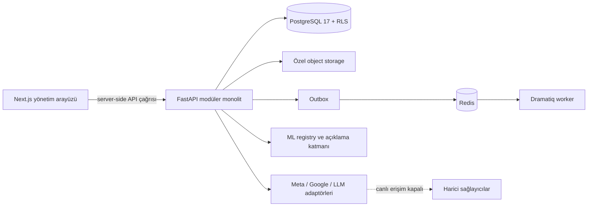

# GrowthPilot AI

> Samsung Innovation Campus — AI in Marketing Capstone · Group 7 — Production-oriented,
> tenant-safe customer operations and marketing intelligence platform.

GrowthPilot AI; müşteri, satış, ürün, stok ve reklam verisini tek bir çalışma alanında
buluşturan, açıklanabilir makine öğrenmesiyle karar desteği sağlayan ve pazarlama
aksiyonlarını onay/güvenlik sınırları içinde yöneten bir SaaS referans uygulamasıdır.

Bu repository iki amacı birlikte taşır:

1. Gerçek bir ürüne dönüştürülebilecek güvenli ve test edilmiş uygulama temeli sunmak.
2. Samsung Innovation Campus bitirme projesi için dürüst, izlenebilir ve yeniden
   üretilebilir akademik kanıt sağlamak.

> [!IMPORTANT]
> **Durum: yerel yapı tamamlandı; production deployment onayı yoktur.** Uygulama,
> testler, akademik teslimler ve altyapı tanımları yerelde hazırdır. Canlı kimlik
> sağlayıcıları, Meta/Google/LLM hesapları, bulut uygulaması ve gerçek reklam harcaması
> kullanılmamıştır. Ayrıntılı karar: [Production Readiness Report](docs/PRODUCTION_READINESS_REPORT.md).

## İçindekiler

- [Ürün ne yapıyor?](#ürün-ne-yapıyor)
- [Sistem nasıl çalışıyor?](#sistem-nasıl-çalışıyor)
- [Repository haritası](#repository-haritası)
- [Nereden başlamalıyım?](#nereden-başlamalıyım)
- [Yerel kurulum](#yerel-kurulum)
- [Test ve kalite](#test-ve-kalite)
- [Makine öğrenmesi kanıtı](#makine-öğrenmesi-kanıtı)
- [Akademik teslimler](#akademik-teslimler)
- [Güvenlik ve kanıt ilkeleri](#güvenlik-ve-kanıt-ilkeleri)
- [Production öncesi kalan doğrulamalar](#production-öncesi-kalan-doğrulamalar)

## Ürün ne yapıyor?

| Alan | Yerel yapıda bulunan yetenekler |
|---|---|
| Müşteri operasyonları | CRM kayıtları, Customer 360, üyelik/rol denetimi ve tenant kapsamı |
| Ticaret ve stok | Ürün, sipariş, iade ve stok hareketleri |
| Veri alımı | Güvenli CSV/XLSX önizleme, eşleme, doğrulama, hata dosyası ve provenance |
| Analitik | Tek merkezden KPI, RFM/değer görünümü ve açık boş/veri-yok durumları |
| ML karar desteği | Sürümlü özellikler, kalibre churn olasılığı, açıklamalar ve model registry |
| Pazarlama | Attribution, izin kontrollü audience snapshot, kampanya onayı, bütçe ve kill-switch |
| Entegrasyonlar | Provider-neutral Meta/Google adaptörleri; credential-free contract testleri |
| Üretken AI | Doğrulanmış gerçeklere dayalı içerik bağlamı ve desteklenmeyen iddia reddi |
| Operasyon | Sağlık/metric uçları, audit kayıtları, Redis/Dramatiq işler ve recovery runbook |
| Arayüz | Next.js tabanlı, desktop/mobile ve Axe ile denetlenmiş yönetim ekranları |

İlk sürümün akademik ML problemi **90 günlük gelecekte işlem yapmama olasılığıdır**.
Bu churn sınıflandırması ürünün tamamı değil, karar destek katmanının ilk kanıtlanmış
kullanım senaryosudur. Kapsam ayrıntısı için [Product Scope](docs/01_PRODUCT_SCOPE.md).

## Sistem nasıl çalışıyor?



- Tenant kimliği istemci gövdesinden güvenilir kabul edilmez; üyelik çözümleme ve RLS
  sunucu tarafında uygulanır.
- İş kuralları UI veya notebook içinde çoğaltılmaz; domain servislerinde merkezileştirilir.
- Kampanya oluşturmak ile kampanya çalıştırmak ayrıdır. Onay, güncel consent, bütçe ve
  kill-switch kontrolleri geçmeden dış aksiyon oluşmaz.
- ML skoru nedensel etki veya gelir garantisi değildir; model/snapshot sürümüyle birlikte
  karar desteği olarak saklanır.

Onaylı kararların tamamı için [Architecture Decisions](docs/03_ARCHITECTURE_DECISIONS.md)
ve [ADR dizini](docs/adr/README.md) okunmalıdır.

## Repository haritası

```text
.
├── apps/web/                 # Next.js kullanıcı arayüzü ve E2E testleri
├── backend/
│   ├── app/                  # FastAPI domain modülleri ve platform altyapısı
│   ├── migrations/           # Alembic + PostgreSQL/RLS migration'ları
│   └── tests/                # Birim, entegrasyon ve güvenlik sınırı testleri
├── academic/
│   ├── submissions/          # Akademik Markdown, DOCX ve PDF kaynak paketi
│   ├── presentation/         # Düzenlenebilir PPTX ve sekiz slaytlık PDF
│   └── figures/              # Rapor/sunum görselleri
├── artifacts/
│   ├── eda/                  # Yeniden üretilmiş EDA çıktıları
│   ├── ml/                   # Model seçimi, test, açıklama ve registry kanıtı
│   └── reports/              # Veri profili ve hazırlama raporları
├── data/                     # Yerel veri katmanları; hassas/büyük veri Git dışında
├── docs/
│   ├── adr/                  # Kabul edilmiş Architecture Decision Records
│   └── tasks/                # PHASE-01…PHASE-24 teslim kayıtları
├── infra/                    # Container ve doğrulanmış AWS Terraform referansı
├── references/instructor/    # Değiştirilmemiş altı eğitmen kaynak dosyası
├── scripts/                  # Kurulum, veri, ML, kalite ve teslim otomasyonu
├── ödevler/                  # Teslime hazır, düzenli DOCX/PDF/PPTX paketi
├── .env.example              # Sadece örnek değişkenler; gerçek secret içermez
├── pyproject.toml            # Python bağımlılık ve kalite ayarları
├── package.json              # pnpm workspace komutları
└── uv.lock / pnpm-lock.yaml  # Tekrarlanabilir bağımlılık kilitleri
```

Yerelde üretilen `.env`, `.local/`, `data/raw/`, `data/processed/`, `mlruns/`,
`node_modules/`, `.next/`, test raporları ve cache dizinleri bilinçli olarak Git dışında
tutulur. İzlenen artifact dosyaları ise raporlanan sonuçları yeniden incelemek için küçük,
anonimleştirilmiş/özet proje kanıtlarıdır.

## Nereden başlamalıyım?

| Amacınız | İlk okunacak dosya |
|---|---|
| Projeyi 5 dakikada anlamak | Bu README ve [Project Charter](docs/00_PROJECT_CHARTER.md) |
| Ürün kapsamını incelemek | [Product Scope](docs/01_PRODUCT_SCOPE.md) |
| Sistemi yerelde çalıştırmak | [Local Development](docs/LOCAL_DEVELOPMENT.md) |
| Mimariyi değerlendirmek | [Architecture Decisions](docs/03_ARCHITECTURE_DECISIONS.md) |
| Veri/ML yöntemini denetlemek | [Data and ML Plan](docs/05_DATA_AND_ML_PLAN.md) ve [Model Evaluation](docs/MODEL_EVALUATION.md) |
| Güvenlik sınırlarını görmek | [Security, Privacy & Responsible AI](docs/07_SECURITY_PRIVACY_RESPONSIBLE_AI.md) |
| 24 aşamanın durumunu görmek | [Task Index](docs/tasks/README.md) ve [Task Log](docs/10_TASK_LOG.md) |
| Demoyu yürütmek | [Demo Guide](docs/DEMO_GUIDE.md) |
| Ödevleri teslim etmek | [Ödev Teslim Rehberi](ödevler/README.md) |
| Nihai ödev denetimini görmek | [Assignment Final Audit](docs/ASSIGNMENT_FINAL_AUDIT.md) |
| Tüm belgeler arasında gezinmek | [Documentation Index](docs/README.md) |

## Yerel kurulum

### Gereksinimler

| Araç | Beklenen sürüm / kullanım |
|---|---|
| Python | 3.12 |
| uv | Kilitli Python ortamı ve komut çalıştırma |
| PostgreSQL | 17 araçları (`initdb`, `pg_ctl`) |
| Redis | Yerel durable job akışı |
| Node.js | 22 |
| pnpm | 11.20.0 |

macOS/Linux üzerinde repository kökünden:

```sh
uv sync --frozen
pnpm install --frozen-lockfile
uv run python scripts/local_setup.py
uv run alembic upgrade head
uv run python scripts/migrate_test.py
uv run python scripts/local_redis.py
```

`local_setup.py`, izole PostgreSQL kümesini `.local/postgres/` altında kurar ve ilk
çalıştırmada mode-600 `.env` dosyasına rastgele yerel secret'lar yazar. Var olan `.env`
ve veri durumu korunur. Bu dosyayı paylaşmayın veya commit etmeyin.

API'yi başlatın:

```sh
uv run uvicorn app.main:create_app --factory --host 127.0.0.1 --port 8000
```

Yeni terminalde web arayüzünü başlatın:

```sh
pnpm dev
```

- API sağlık kontrolü: `http://127.0.0.1:8000/health/live`
- OpenAPI arayüzü: `http://127.0.0.1:8000/docs`
- Web arayüzü: `http://127.0.0.1:3000`

Web uygulamasının gerçek tenant verisi göstermesi için Next.js sunucu ortamında ayrıca
`GP_API_URL`, `GP_SERVER_TOKEN` ve `GP_ORGANIZATION_ID` provision edilmelidir. Bunlar
yoksa UI sahte veri göstermek yerine açık bir **unconfigured** durumu sunar. Ayrıntılı
kurulum ve worker komutları: [Local Development](docs/LOCAL_DEVELOPMENT.md) ve
[Imports & Jobs](docs/IMPORTS_AND_JOBS.md).

## Test ve kalite

Backend kalite kapısı:

```sh
sh scripts/quality.sh
```

Frontend kapıları:

```sh
pnpm typecheck
pnpm lint
pnpm test
pnpm build
pnpm --filter @growthpilot/web exec playwright install chromium
pnpm test:e2e
```

Son doğrulanmış yerel sonuç: Ruff geçti, 121 Python dosyası formatlı, strict mypy 74
kaynakta geçti, pytest **83/83**, Vitest **2/2** ve Playwright/Axe **26/26** geçti.
Next.js production build tamamlandı; Python ve Node dependency audit'lerinde bilinen açık
bulunmadı. Güncel ve sınırlamalarıyla birlikte kanıt için
[Production Readiness Report](docs/PRODUCTION_READINESS_REPORT.md) esas alınmalıdır.

## Makine öğrenmesi kanıtı

| Ölçüm | Dokunulmamış zamansal test sonucu |
|---|---:|
| Test satırı / pozitif oran | 2.772 / 0,392857 |
| PR-AUC | 0,647525 · %95 CI 0,618131–0,678937 |
| ROC-AUC | 0,765878 · %95 CI 0,748534–0,782761 |
| Brier | 0,199854 · %95 CI 0,192598–0,207125 |
| Top-%10 precision / lift | 0,748201 / 1,904513 |

Hedef `future-inactivity-v1`: uygun bir müşterinin takip eden 90 günde yeni alışveriş
yapmaması. Bu sonuçlar tek bir tarihsel perakendeci veri kümesinde proje tarafından
yeniden üretilmiştir; production, nedensel etki veya gelir sonucu değildir. Nihai test
sonrası tuning yasaktır. Kanıtlar: [Model Evaluation](docs/MODEL_EVALUATION.md),
[`final_evaluation.json`](artifacts/ml/final_evaluation.json) ve
[`model_registry.json`](artifacts/ml/model_registry.json).

## Akademik teslimler

Teslim edilecek sade paket doğrudan [`ödevler/`](ödevler/README.md) altındadır:

1. Literatür, veri ve teknoloji incelemesi — DOCX + PDF
2. Kavram notu ve uygulama planı — DOCX + PDF
3. Veri hazırlama, özellik mühendisliği ve model keşfi — DOCX + PDF
4. Model iyileştirme ve test — DOCX + PDF
5. Haftalık ilerleme raporu — DOCX + tek sayfa PDF
6. Final sunumu — PPTX + sekiz slayt PDF

`academic/` üretim/kaynak paketidir; `ödevler/` teslim için düzenlenmiş eş kopyalardır.
Altı eğitmen dosyasının orijinalleri [`references/instructor/`](references/README.md)
altında değiştirilmeden korunur. Ayrıntılı eşleme:
[Academic Deliverables Map](docs/11_ACADEMIC_DELIVERABLES_MAP.md). Eğitmen kaynaklarına
karşı içerik, biçim, render, erişilebilirlik ve kanıt kontrollerinin sonucu
[Assignment Final Audit](docs/ASSIGNMENT_FINAL_AUDIT.md) içinde kayıtlıdır.

## Güvenlik ve kanıt ilkeleri

- Her business sorgusu ve mutasyonu tenant kapsamında çalışır; tenant sızıntısı kritik hatadır.
- Secret, authorization header, parola, anahtar ve gereksiz PII loglanmaz/commit edilmez.
- Upload ve harici girdiler doğrulanır; önemli hatalar sessizce atılmaz.
- Consent, rol, onay, bütçe ve kill-switch sunucu tarafında yeniden kontrol edilir.
- Akademik metrikler yalnız commit edilmiş artifact'lardan gelir; sonuç uydurulmaz.
- Kanıtlar **PROJECT-GENERATED / REPRODUCED**, **EXTERNAL-SOURCE** veya
  **PLANNED / FORECAST** olarak ayrılır.
- Demo fixture'ları gerçek müşteri, gelir veya kampanya sonucu değildir.

Güvenlik modeli ve operasyon sınırları için
[Security, Privacy & Responsible AI](docs/07_SECURITY_PRIVACY_RESPONSIBLE_AI.md) ile
[Operations, Security & Recovery](docs/OPERATIONS_SECURITY_RECOVERY.md) birlikte okunmalıdır.

## Production öncesi kalan doğrulamalar

- Production OIDC, tenant mapping ve yetkilendirme doğrulaması
- Gerçek Meta/Google/LLM sandbox kimlik bilgileriyle contract/live testleri
- Chrome dışı tarayıcı ve yardımcı teknolojiyle manuel erişilebilirlik incelemesi
- Production-benzeri yük, retry, hata enjeksiyonu ve dış güvenlik testi
- Container build/scan/sign ve kontrollü cloud apply
- Yönetilen backup/restore tatbikatı
- Güncel tenant verisinde drift, kalibrasyon, subgroup ve hukuki kullanım değerlendirmesi
- Rastgele holdout içeren onaylı kampanya etki deneyi

Bu kapılar tamamlanmadan sistem production-ready veya kampanya etkisi kanıtlanmış olarak
sunulmamalıdır.

## Proje kayıtları

- Resmî repository: <https://github.com/edasaruhan/SIC_AI_17_Capstone_Group_7>
- Product Owner / Founder: **Şahin Başcı**
- Teslim durumu: **Local build complete — Project Lead final audit required**
- Lisans: Repository henüz açık kaynak lisansı beyan etmez; özellikle eğitmen kaynakları
  yeniden kullanım izni varmış gibi değerlendirilmemelidir.
