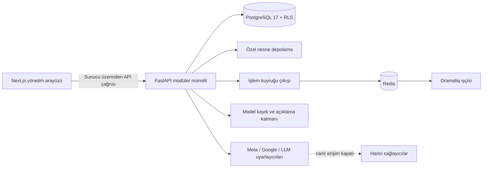

# GrowthPilot AI

Samsung Innovation Campus · Pazarlamada Yapay Zekâ Bitirme Projesi · Grup 7

GrowthPilot AI; müşteri, satış, ürün, stok ve reklam verisini tek çalışma alanında
buluşturan bir uygulamadır. Açıklanabilir makine öğrenmesi karar desteği sağlar;
pazarlama eylemleri ise insan onayı, güncel rıza, bütçe ve güvenlik denetimlerine bağlıdır.
Bu depo hem çalışan yerel ürünü hem de bitirme projesinin kaynağı izlenebilir teslimlerini
içerir.

> [!IMPORTANT]
> **Akademik paket hazır; canlı üretim dağıtımı yapılmadı.** Uygulama ve testler yerelde
> çalıştırıldı. AWS tanımı bir referans mimaridir; gerçek müşteri verisinde model
> doğrulaması, üretim kimlik sağlayıcısı, canlı Meta/Google/LLM entegrasyonları ve
> reklam harcaması yoktur. Ayrıntılar: [üretime hazırlık raporu](docs/PRODUCTION_READINESS_REPORT.md).

## Eğitmenler için hızlı inceleme

| Adım | Ne açılmalı? | Ne gösterir? |
| --- | --- | --- |
| İlk bakış | [Final sunumu PDF](ödevler/06_Final_Sunumu/Odev_06_GrowthPilot_Final_Sunumu.pdf) | Sekiz slaytta problem, ürün, veri, ML sonucu ve sınırlar |
| Sonuçları denetleme | [Model iyileştirme ve test PDF](ödevler/04_Model_Iyilestirme_ve_Test/Odev_04_Model_Iyilestirme_ve_Test.pdf) | Dondurulmuş zamansal test, kalibrasyon ve hata analizi |
| Çalışma zamanı | [Model dağıtımı PDF](ödevler/07_Deployment/Odev_07_Model_Dagitimi_Deployment.pdf) | API, güvenlik, izleme, kod düzeltmeleri ve canlıya geçiş eksikleri |
| Ayrıntılı doğrulama | [Eğitmen inceleme rehberi](docs/INSTRUCTOR_REVIEW_GUIDE.md) | Her önemli iddia için belge, kod, test ve kanıt yolu |

Teslime hazır tüm dosyalar aşağıdaki [akademik teslimler](#akademik-teslimler)
tablosunda doğrudan açılabilir. Kaynak dosyalar ve yeniden üretim adımları
[`academic/`](academic/README.md) altında açıklanır.

## İçindekiler

- [Ürün ne yapıyor?](#ürün-ne-yapıyor)
- [Sistem nasıl çalışıyor?](#sistem-nasıl-çalışıyor)
- [Depo haritası](#depo-haritası)
- [Nereden başlamalıyım?](#nereden-başlamalıyım)
- [Yerel kurulum](#yerel-kurulum)
- [Test ve kalite](#test-ve-kalite)
- [Makine öğrenmesi kanıtı](#makine-öğrenmesi-kanıtı)
- [Akademik teslimler](#akademik-teslimler)
- [Güvenlik ve kanıt ilkeleri](#güvenlik-ve-kanıt-ilkeleri)
- [Canlıya geçiş öncesi eksikler](#canlıya-geçiş-öncesi-eksikler)
- [Proje kayıtları](#proje-kayıtları)

## Ürün ne yapıyor?

| Alan | Yerelde uygulanmış işlev | Kod ve açıklama |
| --- | --- | --- |
| Müşteri ve erişim | CRM, Customer 360, üyelik ve rol denetimi | [`crm/`](backend/app/crm/), [`identity/`](backend/app/identity/) |
| Ticaret ve stok | Ürün, sipariş, iade, stok kayıtları | [`catalog/`](backend/app/catalog/), [`commerce/`](backend/app/commerce/) |
| Veri alımı | CSV/XLSX önizleme, eşleme, doğrulama ve satır bazlı hata kaydı | [`imports/`](backend/app/imports/), [iş akışı](docs/IMPORTS_AND_JOBS.md) |
| Analitik | Ortak KPI tanımları, RFM/değer görünümü ve açık veri-yok durumları | [`analytics/`](backend/app/analytics/), [KPI sözleşmesi](docs/ANALYTICS_CONTRACT.md) |
| ML karar desteği | Sürümlü özellikler, kalibre olasılık, açıklama ve insan incelemesi | [`intelligence/`](backend/app/intelligence/), [model kanıtı](docs/MODEL_EVALUATION.md) |
| Pazarlama | Atıf kaydı, rızaya bağlı hedef kitle anlık görüntüsü, kampanya onayı ve durdurma denetimi | [`marketing/`](backend/app/marketing/), [güvenlik sınırı](docs/INTEGRATIONS_MARKETING_SAFETY.md) |
| Harici servisler | Meta/Google uyarlayıcıları ve sözleşme testleri; canlı kimlik bilgileriyle sınanmadı | [`integrations/`](backend/app/integrations/) |
| Üretken AI | Doğrulanmış olgulara bağlı içerik bağlamı ve desteklenmeyen iddia reddi; canlı sağlayıcı yok | [`generation/`](backend/app/generation/) |
| Operasyon | Sağlık/ölçüt uçları, denetim kayıtları, kalıcı iş durumu ve kurtarma yönergesi | [`platform/`](backend/app/platform/), [operasyon rehberi](docs/OPERATIONS_SECURITY_RECOVERY.md) |
| Arayüz | Gerçek API durumlarını gösteren Next.js yönetim ekranları | [`apps/web/`](apps/web/README.md) |

İlk sürümün akademik ML problemi **90 günlük gelecekte işlem yapmama olasılığıdır**.
Bu müşteri kaybı (churn) sınıflandırması ürünün tamamı değil, karar destek katmanının
ilk kanıtlanmış kullanım senaryosudur. Kapsam ayrıntısı için
[ürün kapsamına](docs/01_PRODUCT_SCOPE.md) bakın.

## Sistem nasıl çalışıyor?



- Organizasyon kimliği istemci gövdesinden güvenilir kabul edilmez; üyelik çözümleme ve RLS
  sunucu tarafında uygulanır.
- İş kuralları arayüz veya not defteri içinde çoğaltılmaz; alan servislerinde merkezileştirilir.
- Kampanya oluşturmak ile kampanya çalıştırmak ayrıdır. Onay, güncel rıza, bütçe ve
  durdurma anahtarı denetimleri geçmeden dış eylem oluşmaz.
- ML skoru nedensel etki veya gelir garantisi değildir; model ve veri anlık görüntüsü
  sürümüyle birlikte karar desteği olarak saklanır.

Onaylı kararların tamamı için [mimari kararlar](docs/03_ARCHITECTURE_DECISIONS.md)
ve [ADR dizini](docs/adr/README.md) okunmalıdır.

## Depo haritası

```text
.
├── apps/web/                 # Next.js kullanıcı arayüzü ve E2E testleri
├── backend/
│   ├── app/                  # FastAPI alan modülleri ve platform altyapısı
│   ├── migrations/           # Alembic + PostgreSQL/RLS şema geçişleri
│   └── tests/                # Birim, entegrasyon ve güvenlik sınırı testleri
├── academic/
│   ├── submissions/          # Akademik Markdown, DOCX ve PDF kaynak paketi
│   ├── presentation/         # Düzenlenebilir PPTX ve sekiz slaytlık PDF
│   └── figures/              # Rapor/sunum görselleri
├── artifacts/
│   ├── eda/                  # Yeniden üretilmiş EDA çıktıları
│   ├── ml/                   # Model seçimi, test, açıklama ve registry kanıtı
│   └── reports/              # Veri profili ve hazırlama raporları
├── data/                     # Yerel veri katmanları; hassas/büyük veri Git dışında
├── docs/
│   ├── adr/                  # Kabul edilmiş mimari karar kayıtları
│   └── tasks/                # PHASE-01…24 ve ek TASK-* kayıtları
├── infra/                    # Container ve doğrulanmış AWS Terraform referansı
├── references/instructor/    # Değiştirilmemiş yedi eğitmen kaynak dosyası
├── scripts/                  # Kurulum, veri, ML, kalite ve teslim otomasyonu
├── ödevler/                  # Teslime hazır, düzenli DOCX/PDF/PPTX paketi
├── .env.example              # Yalnız örnek değişkenler; gerçek gizli bilgi içermez
├── pyproject.toml            # Python bağımlılık ve kalite ayarları
├── package.json              # pnpm workspace komutları
└── uv.lock / pnpm-lock.yaml  # Tekrarlanabilir bağımlılık kilitleri
```

Yerelde üretilen `.env`, `.local/`, `data/raw/`, `data/processed/`, `mlruns/`,
`node_modules/`, `.next/`, test raporları ve önbellek dizinleri bilinçli olarak Git dışında
tutulur. İzlenen `artifacts/` dosyaları raporlanan sonuçları incelemek için sürümlenmiş
proje çıktılarıdır; ham veri veya çalışma zamanı model dosyası değildir.

## Nereden başlamalıyım?

| Amacınız | İlk okunacak dosya |
|---|---|
| Projeyi beş dakikada anlamak | [Eğitmen inceleme rehberi](docs/INSTRUCTOR_REVIEW_GUIDE.md) ve [proje tanımı](docs/00_PROJECT_CHARTER.md) |
| Ürün kapsamını incelemek | [Ürün kapsamı](docs/01_PRODUCT_SCOPE.md) |
| Sistemi yerelde çalıştırmak | [Yerel geliştirme rehberi](docs/LOCAL_DEVELOPMENT.md) |
| Mimariyi değerlendirmek | [Mimari kararlar](docs/03_ARCHITECTURE_DECISIONS.md) |
| Veri/ML yöntemini denetlemek | [Veri ve ML planı](docs/05_DATA_AND_ML_PLAN.md) ile [model değerlendirmesi](docs/MODEL_EVALUATION.md) |
| Güvenlik sınırlarını görmek | [Güvenlik, gizlilik ve sorumlu AI](docs/07_SECURITY_PRIVACY_RESPONSIBLE_AI.md) |
| Uygulama aşamalarının durumunu görmek | [Görev dizini](docs/tasks/README.md) ve [görev günlüğü](docs/10_TASK_LOG.md) |
| Demoyu yürütmek | [Demo rehberi](docs/DEMO_GUIDE.md) |
| Ödevleri teslim etmek | [Ödev teslim rehberi](ödevler/README.md) |
| Nihai ödev denetimini görmek | [Nihai ödev denetimi](docs/ASSIGNMENT_FINAL_AUDIT.md) |
| Tüm belgeler arasında gezinmek | [Belge dizini](docs/README.md) |

## Yerel kurulum

### Gereksinimler

| Araç | Beklenen sürüm / kullanım |
|---|---|
| Python | 3.12 |
| uv | Kilitli Python ortamı ve komut çalıştırma |
| PostgreSQL | 17 araçları (`initdb`, `pg_ctl`) |
| Redis | Yerel durable job akışı |
| Node.js | 22 |
| pnpm | 11.20.0 |

macOS/Linux üzerinde depo kökünden:

```sh
uv sync --frozen
pnpm install --frozen-lockfile
uv run python scripts/local_setup.py
uv run alembic upgrade head
uv run python scripts/migrate_test.py
uv run python scripts/local_redis.py
```

`local_setup.py`, izole PostgreSQL kümesini `.local/postgres/` altında kurar ve ilk
çalıştırmada yalnız kullanıcı tarafından okunabilen `.env` dosyasına rastgele yerel
gizli bilgiler yazar. Var olan `.env` ve veri durumu korunur. Bu dosyayı paylaşmayın
veya Git'e eklemeyin.

API'yi başlatın:

```sh
uv run uvicorn app.main:create_app --factory --host 127.0.0.1 --port 8000
```

Yeni terminalde web arayüzünü başlatın:

```sh
pnpm dev
```

- API sağlık kontrolü: `http://127.0.0.1:8000/health/live`
- OpenAPI arayüzü: `http://127.0.0.1:8000/docs`
- Web arayüzü: `http://127.0.0.1:3000`

Web uygulamasının gerçek organizasyon verisi göstermesi için Next.js sunucu ortamında
ayrıca `GP_API_URL`, `GP_SERVER_TOKEN` ve `GP_ORGANIZATION_ID` ayarlanmalıdır. Bunlar
yoksa arayüz sahte veri göstermek yerine açık bir **yapılandırılmamış** durum sunar.
Yerel kurulum otomatik olarak demo kullanıcıları veya arayüz kimlik bilgileri oluşturmaz.
Ayrıntılı adımlar: [yerel geliştirme](docs/LOCAL_DEVELOPMENT.md),
[demo rehberi](docs/DEMO_GUIDE.md) ve [veri alımı/işler](docs/IMPORTS_AND_JOBS.md).

## Test ve kalite

Arka uç kalite kapısı:

```sh
sh scripts/quality.sh
```

Arayüz kalite kapıları:

```sh
pnpm typecheck
pnpm lint
pnpm test
pnpm build
pnpm --filter @growthpilot/web exec playwright install chromium
pnpm test:e2e
```

22 Eylül 2026 yerel arka uç tekrarında Ruff geçti, 127 Python dosyasının biçimi
doğrulandı, sıkı mypy 75 kaynak dosyasında geçti ve pytest **86/86** testi geçti.
Önceki tam arayüz kapısında Vitest **2/2**, Playwright/Axe **26/26** ve Next.js üretim
derlemesi geçti; bağımlılık denetimleri o kapıda bilinen açık bildirmedi. Bunlar
**yerel çalıştırma sonuçlarıdır**, GitHub Actions veya canlı dağıtım sonucu değildir.
Kapsam, tarih ve kalan kapılar için [üretime hazırlık raporuna](docs/PRODUCTION_READINESS_REPORT.md)
bakın.

## Makine öğrenmesi kanıtı

| Ölçüm | Dokunulmamış zamansal test sonucu |
|---|---:|
| Test satırı / pozitif oran | 2.772 / 0,392857 |
| PR-AUC | 0,647525 · %95 CI 0,618131–0,678937 |
| ROC-AUC | 0,765878 · %95 CI 0,748534–0,782761 |
| Brier | 0,199854 · %95 CI 0,192598–0,207125 |
| Top-%10 precision / lift | 0,748201 / 1,904513 |

Hedef `future-inactivity-v1`: uygun bir müşterinin takip eden 90 günde yeni alışveriş
yapmaması. Bu sonuçlar tek bir tarihsel perakendeci veri kümesinde proje tarafından
yeniden üretilmiştir; canlı müşteri performansı, nedensel etki veya gelir sonucu değildir.
Nihai test sonrası model ayarı seçimi yasaktır. Çalışma zamanında ülke alanının tüm
kayıtlarda `__missing__` olması, eğitim verisiyle uyumsuzluk yaratır ve canlı kullanım
öncesi çözülmelidir. Kanıtlar: [model değerlendirmesi](docs/MODEL_EVALUATION.md),
[`final_evaluation.json`](artifacts/ml/final_evaluation.json) ve
[`model_registry.json`](artifacts/ml/model_registry.json).

## Akademik teslimler

Teslim kopyaları [`ödevler/`](ödevler/README.md) altında numara sırasıyla bulunur.
PDF hızlı okumak, DOCX/PPTX ise düzenlenebilir dosyayı incelemek içindir.

| No | Teslim | PDF | Düzenlenebilir dosya |
| --- | --- | --- | --- |
| 01 | Literatür, veri ve teknoloji incelemesi | [PDF](ödevler/01_Literatur_Veri_Teknoloji/Odev_01_Literatur_Veri_Teknoloji.pdf) | [DOCX](ödevler/01_Literatur_Veri_Teknoloji/Odev_01_Literatur_Veri_Teknoloji.docx) |
| 02 | Kavram notu ve uygulama planı | [PDF](ödevler/02_Kavram_Notu_Uygulama_Plani/Odev_02_Kavram_Notu_Uygulama_Plani.pdf) | [DOCX](ödevler/02_Kavram_Notu_Uygulama_Plani/Odev_02_Kavram_Notu_Uygulama_Plani.docx) |
| 03 | Veri hazırlama, özellik mühendisliği ve model keşfi | [PDF](ödevler/03_Veri_Hazirlama_Ozellik_Muhendisligi_Model_Kesfi/Odev_03_Veri_Hazirlama_Ozellik_Muhendisligi_Model_Kesfi.pdf) | [DOCX](ödevler/03_Veri_Hazirlama_Ozellik_Muhendisligi_Model_Kesfi/Odev_03_Veri_Hazirlama_Ozellik_Muhendisligi_Model_Kesfi.docx) |
| 04 | Model iyileştirme ve test | [PDF](ödevler/04_Model_Iyilestirme_ve_Test/Odev_04_Model_Iyilestirme_ve_Test.pdf) | [DOCX](ödevler/04_Model_Iyilestirme_ve_Test/Odev_04_Model_Iyilestirme_ve_Test.docx) |
| 05 | Haftalık ilerleme raporu | [Tek sayfa PDF](ödevler/05_Haftalik_Ilerleme_Raporu/Odev_05_Haftalik_Ilerleme_Raporu.pdf) | [DOCX](ödevler/05_Haftalik_Ilerleme_Raporu/Odev_05_Haftalik_Ilerleme_Raporu.docx) |
| 06 | Final sunumu | [Sekiz slayt PDF](ödevler/06_Final_Sunumu/Odev_06_GrowthPilot_Final_Sunumu.pdf) | [PPTX](ödevler/06_Final_Sunumu/Odev_06_GrowthPilot_Final_Sunumu.pptx) |
| 07 | Model dağıtımı | [13 sayfa PDF](ödevler/07_Deployment/Odev_07_Model_Dagitimi_Deployment.pdf) | [DOCX](ödevler/07_Deployment/Odev_07_Model_Dagitimi_Deployment.docx) |

`academic/` Türkçe Markdown kaynakları ile üretilen belge/sunum paketini, `ödevler/`
ise dosya adı ve sırası düzenlenmiş eş kopyaları içerir. Yedi özgün eğitmen dosyası
[`references/instructor/`](references/README.md) altında değiştirilmeden korunur.
Model dağıtımı raporu, eğitmen DOCX şablonunun A4 sayfa sistemi, Times New Roman
tipografisi ve altı bölüm sırasını temel alır. Gereksinim ve dosya eşlemesi
[akademik teslim haritasında](docs/11_ACADEMIC_DELIVERABLES_MAP.md), içerik/biçim/kanıt
denetimi ise [nihai ödev denetiminde](docs/ASSIGNMENT_FINAL_AUDIT.md) kayıtlıdır.
Bu iç denetimler öğretim üyesi kabulü, not veya teslim alındı belgesi değildir.

## Güvenlik ve kanıt ilkeleri

- Her iş sorgusu ve değişikliği organizasyon kapsamında çalışır; organizasyonlar arası
  veri sızıntısı kritik hatadır.
- Gizli bilgiler, yetkilendirme başlıkları, parolalar, anahtarlar ve gereksiz kişisel
  veri günlüklenmez veya Git'e eklenmez.
- Dosya yüklemeleri ve harici girdiler doğrulanır; önemli hatalar sessizce atılmaz.
- Rıza, rol, onay, bütçe ve durdurma anahtarı sunucu tarafında yeniden kontrol edilir.
- Akademik metrikler sürümlenmiş proje çıktılarından gelir; sonuç uydurulmaz.
- Kanıtlar **PROJECT-GENERATED / REPRODUCED**, **EXTERNAL-SOURCE** veya
  **PLANNED / FORECAST** olarak ayrılır.
- Demo verileri gerçek müşteri, gelir veya kampanya sonucu değildir.

Güvenlik modeli ve operasyon sınırları için
[güvenlik, gizlilik ve sorumlu AI](docs/07_SECURITY_PRIVACY_RESPONSIBLE_AI.md) ile
[operasyon ve kurtarma](docs/OPERATIONS_SECURITY_RECOVERY.md) birlikte okunmalıdır.

## Canlıya geçiş öncesi eksikler

- Üretim OIDC, organizasyon eşlemesi ve yetkilendirme doğrulaması
- Gerçek Meta/Google/LLM test ortamı kimlik bilgileriyle canlı sözleşme testleri
- Chrome dışı tarayıcı ve yardımcı teknolojiyle manuel erişilebilirlik incelemesi
- Üretim benzeri yük, yeniden deneme, hata enjeksiyonu ve dış güvenlik testi
- Konteyner imajı oluşturma/tarama/imzalama ve kontrollü bulut kurulumu
- Yönetilen yedekleme ve geri yükleme tatbikatı
- Güncel organizasyon verisinde veri kayması, kalibrasyon, alt grup ve hukuki kullanım değerlendirmesi
- Rastgele kontrol grubu içeren onaylı kampanya etki deneyi

Bu kapılar tamamlanmadan sistem canlı kullanıma hazır veya kampanya etkisi kanıtlanmış
olarak sunulmamalıdır.

## Proje kayıtları

- Resmî depo: <https://github.com/edasaruhan/SIC_AI_17_Capstone_Group_7>
- Product Owner / Founder: **Şahin Başcı**
- Teslim durumu: **Yerel derleme ve akademik denetim tamamlandı; canlı kullanım için
  dış doğrulama kapıları bekliyor.**
- Lisans: Depo henüz açık kaynak lisansı beyan etmez; özellikle eğitmen kaynakları
  yeniden kullanım izni varmış gibi değerlendirilmemelidir.
