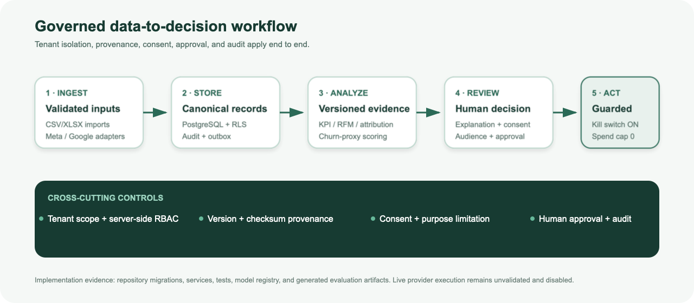

# Kavram Notu ve Uygulama Planı

GrowthPilot AI — küçük perakende ekipleri için yönetişimli müşteri operasyonları ve pazarlama zekâsı

**YAPAY ZEKA KULLANIM BEYANI:** Bu belge OpenAI Codex/ChatGPT desteğiyle hazırlanmış ve depo kanıtlarıyla kontrol edilmiştir. İnsan incelemesi gereklidir.

## Bölüm I — Kavram notu

### 1. Proje özeti, bağlam ve amaçlanan etki

GrowthPilot AI; müşteri, sipariş, ürün, stok ve reklam verisini birleştiren, hafif CRM/ERP iş akışları sunan ve sürümlü analitik ile makine öğrenmesi kanıtını incelenmiş pazarlama kararlarına dönüştüren çok kiracılı, üretime yönelik bir uygulamadır. İlk bitirme projesi ML problemi, 90 günlük gelecekte satın alma hareketsizliği sınıflandırmasıdır; ürünün tamamı değil, bir bileşenidir.

Hedef kullanıcılar tutarlı müşteri kaydı ve müşteriyi elde tutma çalışmalarını daha güvenli önceliklendirme yolu arayan küçük perakende işletmecileri ile pazarlama yöneticileridir. Amaçlanan etki daha hızlı analiz, daha az tanım uyuşmazlığı ve daha disiplinli iletişim incelemesidir. Gelir artışı, benimseme, kampanya veya kullanıcı sonucu henüz ölçülmemiştir.

### 2. Amaçlar ve KPI'lar

| Amaç | KPI | Başlangıç | Hedef / karar kuralı |
| --- | --- | --- | --- |
| Operasyon verisini birleştirmek | Geçerli içe aktarma, reddedilen satır görünürlüğü, kaynak kapsamı | Üretim başlangıç değeri yok | Kabul edilen her içe aktarma kiracı, kaynak, aktör ve sağlama toplamı kaydeder |
| Güvenilir müşteri zekâsı sunmak | KPI güncelliği; tahmin sürümü kapsamı | Üretim başlangıç değeri yok | Her tahmin model/özellik/hedef sürümü ile sağlama toplamını saklar |
| Sınırlı erişimi önceliklendirmek | Kapasitede kesinlik, duyarlılık, artış | Test yaygınlığı 0.392857 | Dondurulmuş yaklaşık %10 politika; kanıt raporlanır, artış vaat edilmez |
| Müşterileri ve kiracıları korumak | Kiracılar arası retler; yetkisiz eylemler | Uygulama öncesi geçersiz | Otomatik yalıtım testlerinde bilinen sızıntı sıfır; tüm eylemler sunucuda yetkilendirilir |
| Pazarlama yürütmesini yönetmek | Rıza, onay, bütçe/acil durdurma engelleri | Canlı yürütme yok | Yürütme varsayılan kapalı; açık onay ve canlı doğrulama gerekir |

Hedefler ticari sonuç değil, yönetişim/kalite kabul kurallarıdır.

### 3. Arka plan ve gerekçe

Analitik not defterleri tek başına veri toplama, kimlik, izin, rıza veya yürütme güvenliğini çözmez. Sözleşmesiz müşteri literatürü hareketsizliğin örtük ve modele bağlı olduğunu gösterir. Bu nedenle GrowthPilot gözlenebilir gelecek satın alma penceresi tanımlar, zamana dayalı doğrulama kullanır ve açık kanıt izi saklar.

### 4. Yapay zekâ yöntemi ve değerlendirme

1. Satın alma ritmini yalnız eğitim geçmişinde profille ve 90 günlük etiket ufkunu dondur.

1. Her kesimden kesinlikle önceki olaylarla sızıntısız müşteri anlık görüntüleri oluştur.

1. Yakınlık sezgiseli, yaygınlık kuklası, düzenlileştirilmiş lojistik regresyon, rastgele orman ve LightGBM'yi karşılaştır.

1. Doğrulama PR-AUC ile seç; nihai teste dokunmadan hiperparametre ve olasılık kalibrasyonunu iyileştir.

1. Model eserini ve yaklaşık %10 kapasite eşiğini dondur; dokunulmamış 2011-09-01 testinde bir kez değerlendir ve test sonrası ayarı yasakla.

1. SHAP/log-olasılık toplamsallığını doğrula; açıklamaları yalnız eğitilmiş model kanıtı olarak sakla.

Birincil ölçütler PR-AUC, ROC-AUC, Brier, log kaybı ve ECE'dir; kapasitede kesinlik/duyarlılık/artış ve nihai test bootstrap aralıkları eklenir. İş etkisi için daha sonra uygun müşterilerin deney/kontrol gruplarına rastgele atanması veya savunulabilir başka nedensel tasarım gerekir.

### 5. Mimari ve iş akışı

*Şekil 1. Uygulanan veriden karara mimari. Yürütme varsayılan kapalıdır.*

Web uygulaması FastAPI modüler tek parçasını çağırır. PostgreSQL kiracı anahtarlarını, kısıtları ve satır düzeyi güvenliği uygular; Redis/Dramatiq çalışanları kalıcı outbox işlerini tüketir. Doğrulanmış içe aktarımlar ve sağlayıcı bağdaştırıcıları standart kayıtları doldurur. Analitik ve puanlama sürümlü tanımları paylaşır. Kitleler anlık görüntülüdür, güncel rıza denetlenir ve kampanyalar kuyruğa alınmadan onaylanır. Harici eylem acil durdurma anahtarı ve sıfır varsayılan bütçeyle engellenir.

### 6. Veri

Deney, UCI Online Retail II'yi (Chen, 2012; CC BY 4.0; DOI 10.24432/C5CG6D) kullanır: 2009-12-01–2011-12-09 döneminde 1.067.371 işlem satırı. Üretimde her kiracının yetkili müşteri/sipariş verisi ve sağlayıcı kimlik bilgileri gerekir. Ham kaynakların sağlama toplamı doğrulanır; müşteri düzeyi hazırlanmış eserler yerelde ve Git dışındadır.

### 7. Literatür ve sektör bağlamı

Jerath, Fader ve Hardie (2011), Batislam ve diğerleri (2007), Platzer ve Reutterer (2016) satın alma ritmine duyarlı ancak operasyonel hareketsizlik tanımını destekler. Modern CRM ve reklam platformları akışın parçalarını sunar; GrowthPilot açık kaynak, kiracı kapsamı ve insan yetkilendirmesi olan bütünleşik, sağlayıcıdan bağımsız bir kontrol düzlemidir. Bu işlevsel bir karşılaştırmadır, ticari üstünlük iddiası değildir.

## Bölüm II — Uygulama planı

### 1. Teknoloji yığını

| Katman | Teknoloji | Sorumluluk |
| --- | --- | --- |
| Web | Next.js, React, katı TypeScript | Gezinme, dürüst yükleme/boş/hata durumları, Müşteri 360 |
| API | Python 3.12, FastAPI, Pydantic, SQLAlchemy | Doğrulama, RBAC, alan kuralları, OpenAPI |
| Veri | PostgreSQL + RLS; S3 uyumlu nesne sınırı | Standart kayıtlar, kaynak, yalıtım, sınırlı ham yük |
| Eşzamansız | Redis, Dramatiq, outbox | İzinleri yeniden denetlenen içe aktarma/eşitleme/puanlama |
| ML | pandas/Polars, scikit-learn, LightGBM, SHAP, MLflow | Özellik hattı, deney, kayıt, açıklama |
| Kalite/operasyon | pytest, Ruff, mypy, Vitest, ESLint, OTel, Prometheus | Otomatik kapılar ve gözlemlenebilirlik |

### 2. Takvim ve sorumluluk

| Dönem | İş paketi | Sorumlu / inceleyen | Kanıt / durum |
| --- | --- | --- | --- |
| 2026-09-08 | Yönetişim, mimari, alan ve veri sözleşmeleri | Codex / Proje Lideri | Yerel commit, ADR ve gereksinimler — tamamlandı |
| 2026-09-08 | Veri araştırması, hazırlık, özellik ve model keşfi | Codex / ML-AI Lideri | Profil, bölme, MLflow — tamamlandı |
| 2026-09-08 | İyileştirme, dondurulmuş test, açıklama | Codex / ML-AI Lideri | Nihai eser ve sağlama toplamı — tamamlandı |
| 2026-09-09 | Çıkarım, arayüz, entegrasyon, atıf, kitle ve üretim | Codex / Proje Lideri | Yerel kod/test — tamam; canlı kimlik bilgisi yok |
| 2026-09-09–13 | Güvenlik, akademik paket, sürüm hazırlığı | Codex / Kurucu | Yerel doğrulama ve kapsamlı teslim denetimi — tamamlandı |
| Onay sonrası | Kimlik bilgili test ortamı, dağıtım, pilot, nedensel test | Kurucu / Proje Lideri | Dış doğrulama — başlamadı |

Bunlar gerçek yerel çalışma tarihleridir; geriye dönük teslim iddiası değildir.

### 3. Kilometre taşları ve kanıt

- M0–M1: yönetişim, kabul edilmiş ADR, tehdit/veri sözleşmesi ve temiz Git geçmişi.

- M2–M5: kaynaklı araştırma, lisanslı veri, yeniden üretilebilir hazırlık, model karşılaştırması, dondurulmuş değerlendirme ve açıklama.

- M6–M10: kiracı güvenli API/arayüz, CRM/ticaret/içe aktarma, zekâ, bağdaştırıcı, atıf, kitle ve onay yaşam döngüsü.

- M11–M12: güvenlik/kurtarma sınırları, testler, akademik teslimler, demo ve sürüm hazırlığı.

### 4. Zorluklar, önlemler ve geri dönüş

| Risk | Önlem | Geri dönüş / karar sınırı |
| --- | --- | --- |
| Tek tarihsel perakendeci yanlılığı | Zamansal bekletme, aralıklar, kanıt etiketleri | Kiracı verisi doğrulanmadan modeli dağıtma |
| Hareketsizlik gerçek kayıp değildir | Operasyonel etiket ve hedef sürümü | Yalnız hareketsizlik riski olarak sun |
| Kiracılar arası sızıntı | Anahtar, sunucu koruması, RLS, saldırgan test | Çözülmemiş sızıntıda sürümü engelle |
| API değişimi/kimlik bilgisi yokluğu | Bağdaştırıcı, sabit köken, taklit, kalıcı eşitleme | Entegrasyonu kapalı tut; CSV/XLSX kullan |
| Kampanya etkisi belirsizliği | Tahmini nedensel ölçümden ayır | Onaylı deney öncesi gönderimsiz plan |
| Güvensiz üretilen içerik | Sunucu gerçekleri, yasak iddia kontrolü, insan onayı | Sağlayıcı kapalı; yalnız manuel taslak |
| Kesinti/veri kaybı | Sağlık/ölçüt, yedek, runbook, kalıcı iş | Geri yükleme tatbikatına kadar RPO/RTO hedeftir |

### 5. Etik ve sorumlu yapay zekâ

- Amaç sınırlaması ve veri minimizasyonu: müşteri çıktıları kiracı içinde; akademik çıktılar topludur.

- Rıza ve insan iradesi: puan eylem yetkisi vermez; kitle üyeliği yeniden kontrol edilir; onay açıktır.

- Şeffaflık: hedef, özellik, model, eşik ve sınırlılıklar sürümlüdür; açıklamalar nedensel değildir.

- Adalet: ülke ve vekil etkileri üretim öncesi hukuka uygun alt grup incelemesi gerektirir; adalet iddiası yoktur.

- Güvenlik: sır değerleri değil referansları saklanır; sağlayıcı istekleri sabit HTTPS kökeni kullanır ve yönlendirme izlemez.

### 6. Güncel teslim sınırı

Yerel uygulama ve akademik kanıt incelemeye hazırdır. Otomatik masaüstü/mobil Chromium ve Axe kontrolleri geçer; canlı Meta/Google/LLM/OIDC/bulut, üretim geri yükleme, manuel çoklu tarayıcı/yardımcı teknoloji ve gerçek kampanya yürütmesi dış doğrulamada bekler. Ücretli dağıtım veya reklam harcaması yapılmamıştır.

## Kaynakça

Chen, D. (2012). Online Retail II [Veri kümesi]. UCI Machine Learning Repository. https://doi.org/10.24432/C5CG6D

Jerath, K., Fader, P. S., & Hardie, B. G. S. (2011). New perspectives on customer “death” using a generalization of the Pareto/NBD model. Marketing Science, 30(5), 866–880. https://doi.org/10.1287/mksc.1110.0654

Batislam, E. P., Denizel, M., & Filiztekin, A. (2007). Empirical validation and comparison of models for customer base analysis. International Journal of Research in Marketing, 24(3), 201–209. https://doi.org/10.1016/j.ijresmar.2006.12.005

Proje kaynakları: docs/03_ARCHITECTURE_DECISIONS.md, docs/08_DELIVERY_PLAN.md, docs/07_SECURITY_PRIVACY_RESPONSIBLE_AI.md, artifacts/reports ve artifacts/ml.
