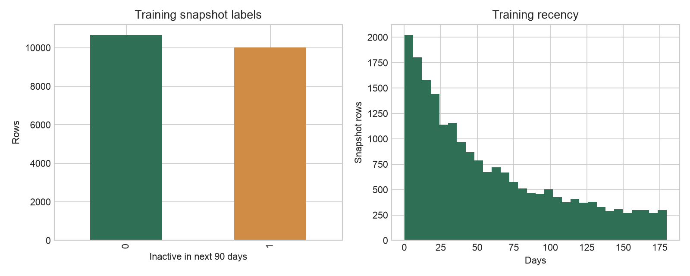
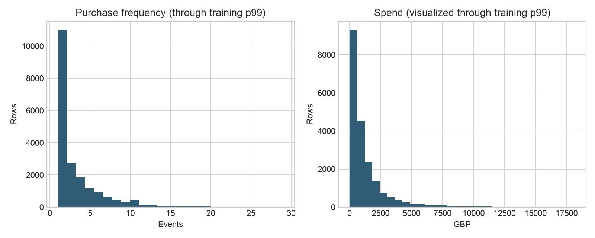

# Veri Hazırlama, Özellik Mühendisliği ve Model Keşfi

Gelecekte satın alma hareketsizliği için yeniden üretilebilir zamansal müşteri modellemesi

**YAPAY ZEKA KULLANIM BEYANI:** Bu belge OpenAI Codex/ChatGPT desteğiyle hazırlanmış ve depo kanıtlarıyla kontrol edilmiştir. İnsan incelemesi gereklidir.

## Bölüm I — Veri hazırlama ve özellik mühendisliği

### 1. Genel bakış ve toplama

İşlem hattı UCI Online Retail II'yi kalıcı depo URL'sinden indirir, SHA-256 572e36277c2390fbfde10664750731e0a86f55e33470d91919085f0408e67bfb değerini doğrular, iki çalışma sayfasını profiller ve belirlenimci raporlar yazar. Ham ve müşteri düzeyi hazırlanmış dosyalar yerelde/Git dışında; toplu kanıtlar ve betikler sürüm denetimindedir.

### 2. Temizleme ve doğrulama

| Adım | Satır / kural | Gerekçe |
| --- | --- | --- |
| Ham girdi | 1.067.371 | Dış kaynak kanıtı korunur |
| Birebir yinelenenleri kaldırma | 34.335 kaldırıldı | Aynı işlem satırının tekrarını önler |
| Kimlik/tarih kullanılabilirliği | 235.151 dışlandı | Anlık görüntü için kararlı kimlik ve zaman gerekir |
| Tutulan normalleştirilmiş satır | 797.885 | Belirlenimci kurallar sonrası standart ad/tür |
| Uygun satın alma olayı | Pozitif miktar/fiyat; iptal değil; kesim öncesi | Satın almayı iade/iptalden ayırır |


Kanıt sınıfı: artifacts/reports/data_preparation.json üzerinden projede üretilmiştir.

Eksik müşteri kimliği atanmamıştır; keyfî atama sahte geçmiş üretirdi. Eksik açıklamalar müşteri davranış özelliklerini engellemez. Pozitif olmayan miktar/fiyat ve iptal faturaları uygun olaylardan çıkarılır ancak kaynak kalite kanıtında kalır. Parasal aykırı değerler toplama öncesi kırpılmaz; log1p ve standartlaştırma eğitilmiş hat içinde ölçek baskısını azaltır.

### 3. Zamansal anlık görüntüler ve sızıntı önleme

| Veri bölümü | Kesim tarihleri | Satır | Hareketsizlik oranı |
| --- | --- | --- | --- |
| Eğitim | 2010-06-01–2010-12-01 aylık | 20.677 | 0.483823 |
| Doğrulama | 2011-03-01 | 3.349 | 0.577187 |
| Kalibrasyon | 2011-06-01 | 2.659 | 0.499436 |
| Nihai test | 2011-09-01 | 2.772 | Nihai değerlendirmeye kadar mühürlü |


Tüm özellikler kesinlikle kesim öncesi olayları kullanır; her 90 günlük etiket penceresi tamamen gözlenir.

### 4. Keşifsel veri analizi



*Şekil 1. Eğitim anlık görüntülerinde etiket yaygınlığı ve yakınlık.*



*Şekil 2. Sıklık ve harcama dağılımları dönüşümlü modellemeyi destekler.*

Eğitim 20.677 müşteri anlık görüntüsü ve %48,3823 hareketsizlik etiketi; doğrulama 3.349 satır ve %57,7187 hareketsizlik içerir. Yaygınlık değişimi doğruluğun neden birincil ölçüt olmadığını gösterir. Çarpıklık ve tekrarlı gözlemler, rastgele satır bölmesi yerine zamana dayalı değerlendirme ve müşteri davranışı toplamlarını destekler.

### 5. Özellik tasarımı

| Özellik ailesi | Örnekler | Gerekçe |
| --- | --- | --- |
| Yakınlık/müşteri yaşı | recency_days, tenure_days | İlişkinin ne kadar yakın ve eski olduğu |
| Sıklık/ritim | invoice_count, active_days, ortalama/medyan/azami aralık | Tekrar ve satın alma dönemselliği |
| Parasal | brüt/net harcama, ortalama sipariş, iade | Ticari büyüklük ve ters işlem |
| Ürün çeşitliliği | farklı ürün, miktar, sepet genişliği | Etkileşim derinliği ve çeşitliliği |
| Pencereli davranış | 30/60/90 günlük sayım/harcama ve eğilim | Kesim öncesi hızlanma veya düşüş |
| Bağlam | ülke ve anlık görüntü ayı | Hat içinde kodlanan pazar/zaman bağlamı |


### 6. Ölçekleme, normalleştirme ve kodlama

scikit-learn ColumnTransformer ön işlemeyi yalnız eğitim verisinde uyarlar. Sayısal sütunlar medyan doldurma, uygun yerde log1p ve lojistik regresyon için StandardScaler kullanır. Kategorikler en sık değerle doldurulur ve bilinmeyen kategori toleranslı one-hot kodlanır. Ağaç adayları, ölçeklemenin ağaçları iyileştirdiğini varsaymadan uyumlu kodlanmış girdi kullanır.

```python
numeric = Pipeline([
    ('impute', SimpleImputer(strategy='median')),
    ('scale', StandardScaler()),
])
categorical = Pipeline([
    ('impute', SimpleImputer(strategy='most_frequent')),
    ('onehot', OneHotEncoder(handle_unknown='ignore')),
])
model = Pipeline([('preprocess', ColumnTransformer(...)),
                  ('classifier', LogisticRegression(C=0.01, max_iter=2000))])
```

## Bölüm II — Model keşfi

### 1. Aday seçimi gerekçesi

Yakınlık sezgiseli iş temeli; kukla önsel, modelin sıralama bilgisi katıp katmadığı kontrolüdür. Lojistik regresyon şeffaf, hızlı ve düzenlileştirilebilir; rastgele orman doğrusal olmayan etkileşimleri; LightGBM verimli artırılmış ağaç yaklaşımını temsil eder. Kavram sunumu LightGBM öngörse de deney ona öncelik vermemiş, doğrulama PR-AUC lojistik regresyonu seçmiştir.

| Aday | Güçlü yön | Zayıf yön |
| --- | --- | --- |
| Yakınlık sezgiseli | Basit ve açıklanabilir | Sıklık, değer ve ritmi yok sayar |
| Kukla önsel | Kalibrasyon/yaygınlık sağlaması | Kişiselleştirilmiş sıralama yok |
| Lojistik regresyon | Şeffaf, verimli, kararlı düzenlileştirme | Doğrusal log-olasılık sınırı |
| Rastgele orman | Doğrusal olmayan etkileşim ve sağlamlık | Daha büyük model; kalibrasyon bozulabilir |
| LightGBM | Güçlü doğrusal olmayan tablo öğrenicisi | Daha karmaşık ayar/yorum ve aşırı uyum riski |


### 2. Eğitim, hiperparametreler ve doğrulama

Adaylar test öncesi yedi kesimde eğitilir. Aile, yalnız 2011-03-01 doğrulamasında seçilir. 2011-06-01 sigmoid kalibrasyon ve eşik için ayrılır; 2011-09-01 keşifte kullanılmaz.

| Model | Temel parametre | Doğrulama PR-AUC | ROC-AUC | Brier | İlk %10 artış |
| --- | --- | --- | --- | --- | --- |
| Yakınlık | clip(recency/180) | 0.715529 | 0.689417 | 0.248166 | 1.292940 |
| Kukla | prior | 0.577187 | 0.500000 | 0.244072 | 0.961948 |
| Lojistik | C=1.0 | 0.805322 | 0.782819 | 0.213300 | 1.510154 |
| Rastgele orman | 300 ağaç; yaprak=10 | 0.803517 | 0.782053 | 0.195463 | 1.520498 |
| LightGBM | 300 ağaç; lr=.05; yaprak=31 | 0.805223 | 0.776941 | 0.200875 | 1.546357 |


Seçim ölçütü doğrulama PR-AUC; ilk kazanan lojistik regresyondur. Nihai test matrisi ve eğrileri sızıntıyı önlemek için keşifte üretilmemiş, test açıldıktan sonra Rapor 04'te sunulmuştur.

### 3. Değerlendirme yorumu

Lojistik PR-AUC 0.805322, LightGBM 0.805223 ve rastgele orman 0.803517 değerlerini az farkla aşar. Ağaçların kalibre edilmemiş Brier değerleri daha iyidir; bu, sonuç gördükten sonra seçim ölçütünü değiştirmeyi değil ayrı kalibrasyonu gerektirir. Yakınlık temeli daha zayıf ama anlamlıdır.

### 4. Yeniden üretilebilirlik

```python
make data-download
make data-profile
make data-prepare
make features-build
make train
# Çıktılar bölme özetlerini, MLflow kimliklerini, parametreleri ve ölçütleri içerir.
```

Her bölüm SHA-256, hedef/özellik/bölme sürümleriyle izlenir; MLflow çalıştırmaları kaydeder. model_exploration.json içindeki final_test bayrağının false olması keşfin nihai testten önce tamamlandığını gösterir.

### 5. Sonuç

Hazırlık hattı sızıntıya dayanıklı ve belirlenimcidir. İlk keşif iyileştirme için lojistik regresyonu seçmiştir. Sonuç belirtilen tarih ve ölçütle sınırlıdır; evrensel üstünlük veya üretim hazırlığı iddiası değildir.

## Kaynakça

Chen, D. (2012). Online Retail II [Veri kümesi]. UCI Machine Learning Repository. https://doi.org/10.24432/C5CG6D

scikit-learn geliştiricileri. Model değerlendirme, ön işleme ve olasılık kalibrasyonu belgeleri. https://scikit-learn.org/stable/

Ke, G., et al. (2017). LightGBM: A highly efficient gradient boosting decision tree. Advances in Neural Information Processing Systems, 30.

Proje kanıtları: artifacts/reports/dataset_profile.json, artifacts/reports/data_preparation.json, artifacts/eda, artifacts/ml/model_exploration.json ve ilgili betikler/testler.
