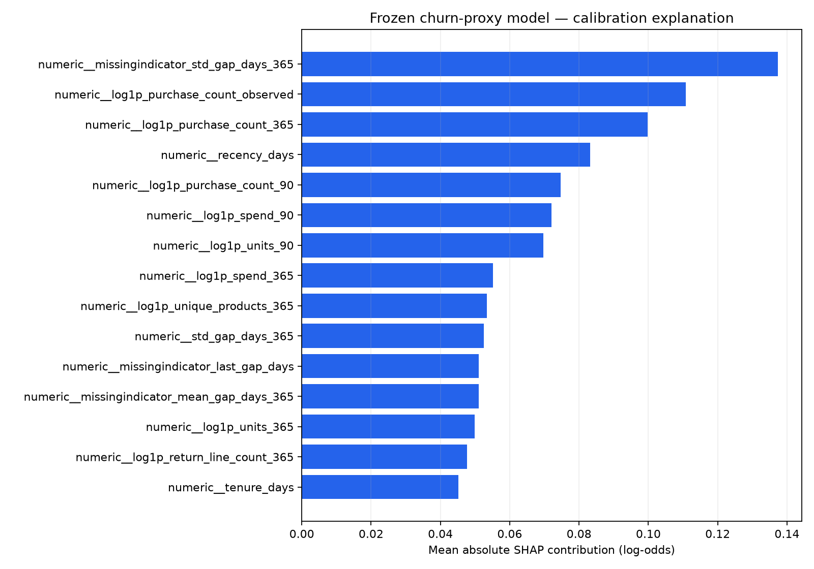
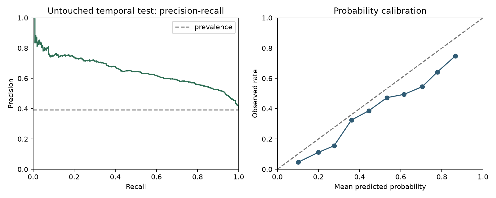

# Model Refinement and Test Submission

Frozen, calibrated logistic churn-proxy candidate and untouched temporal evaluation

**AI AUTHORSHIP DISCLOSURE:** This document was drafted with OpenAI Codex/ChatGPT assistance and checked against repository evidence. Human review remains required.

## Part I — Model refinement

### 1. Initial evaluation and weaknesses

Initial exploration selected logistic regression by validation PR-AUC 0.805322. Its weaknesses were probability miscalibration (Brier 0.213300; ECE 0.169377) and sensitivity to regularization. LightGBM was nearly tied on PR-AUC and had better raw calibration, so refinement compared all three learned families without changing the primary selection rule.

### 2. Refinement techniques

- Logistic grid: C ∈ {0.01, 0.05, 0.2, 1.0, 5.0}; class weighting kept off because ranking/calibration and capacity metrics were evaluated directly.

- Random forest grid: 400 trees, minimum leaf {5,10,20}, maximum depth {8,16}.

- LightGBM: 12 seeded search trials across learning rate, leaves, depth, minimum child samples, L2 regularization, row and column subsampling.

- Sigmoid calibration fitted only on the 2011-06-01 calibration snapshot.

- Operating threshold fixed at 0.812509305136 from approximately 10% calibration capacity.

### 3. Tuning impact

| Stage | PR-AUC | ROC-AUC | Brier | ECE | Top-10% precision / lift |
| --- | --- | --- | --- | --- | --- |
| Initial logistic validation | 0.805322 | 0.782819 | 0.213300 | 0.169377 | 0.871642 / 1.510154 |
| Refined logistic C=.01 validation | 0.812223 | 0.787127 | 0.196710 | 0.106133 | 0.883582 / 1.530841 |
| Calibration-fit descriptive | 0.739014 | 0.773722 | 0.193632 | 0.040863 | 0.834586 / 1.671058 |

Calibration-fit metrics reuse calibration labels and are descriptive, not unbiased test estimates.

Lowering C from 1.0 to 0.01 increased validation PR-AUC to 0.812223 and reduced Brier to 0.196710. Sigmoid calibration on the later calibration split reduced ECE to 0.040863 descriptively. The final serialized candidate checksum is 942d705d66a9469d57494626a99da83c91a9a895a3a2b2d7e977ff3ba56952ad.

### 4. Cross-validation and feature selection decisions

Random k-fold cross-validation was not used because it would mix future and past snapshots and repeated customers. The design instead uses expanding chronological training cutoffs plus distinct validation, calibration and final-test dates. No post-hoc feature selection was performed: the regularized logistic pipeline controls coefficient magnitude, and removing features after observing the test would violate the freeze.

### 5. Explainability validation



*Figure 1. Global mean absolute SHAP contribution in calibrated log-odds. Project-generated diagnostic.*

The SHAP decomposition was computed in calibrated log-odds for the frozen logistic pipeline. Maximum additivity error is 8.881784197001252×10⁻¹⁶, confirming numerical consistency. Contributions explain this model’s score formation; they are not causal effects and must not be turned into unsupported personal claims.

## Part II — Final test submission

### 1. Test preparation and integrity

The final test is the 2,772-customer snapshot at cutoff 2011-09-01 with a fully observed 90-day label window. Its prepared-file SHA-256 is 2830e4738acfee8c5561f5eb513874d0cacae32f3b3095c412db62dc2cf78ff6. Before access, the candidate manifest, preprocessing, sigmoid calibrator, artifact checksum and threshold were frozen. Post-test retuning is prohibited.

### 2. Model application

```python
bundle = joblib.load('artifacts/models/final_candidate.joblib')
assert sha256_file(model_path) == EXPECTED_MODEL_SHA256
scores = bundle['calibrated_model'].predict_proba(X_test)[:, 1]
predicted = scores >= 0.812509305136
# target, feature and split versions are checked before reporting
```

### 3. Final test metrics

| Measure | Final test result | 95% bootstrap interval |
| --- | --- | --- |
| Rows / prevalence | 2,772 / 0.392857 | Not applicable |
| PR-AUC | 0.647525 | [0.618131, 0.678937] |
| ROC-AUC | 0.765878 | [0.748534, 0.782761] |
| Brier score | 0.199854 | [0.192598, 0.207125] |
| Log loss | 0.582761 | Not bootstrapped |
| ECE (10 bins) | 0.095054 | Not bootstrapped |
| Top-10% precision / recall / lift | 0.748201 / 0.191001 / 1.904513 | Not bootstrapped |

Evidence class: project-executed, untouched temporal holdout. Intervals are nonparametric row bootstrap intervals for this cutoff.



*Figure 2. Final temporal-test precision–recall and probability calibration.*

### 4. Frozen-threshold confusion matrix

| Actual / predicted | Predicted active | Predicted inactive |
| --- | --- | --- |
| Actual active | TN = 1,603 | FP = 80 |
| Actual inactive | FN = 867 | TP = 222 |

Threshold 0.812509305136 selected 302 customers (10.8947%): precision 0.735099, recall 0.203857, F1 0.319195.

### 5. Validation-to-test comparison

| Split | PR-AUC | ROC-AUC | Brier | Prevalence | Interpretation |
| --- | --- | --- | --- | --- | --- |
| Validation | 0.812223 | 0.787127 | 0.196710 | 0.577187 | Used for family/tuning selection |
| Calibration | 0.739014 | 0.773722 | 0.193632 | 0.499436 | Used for sigmoid and threshold; descriptive |
| Final test | 0.647525 | 0.765878 | 0.199854 | 0.392857 | Single untouched temporal holdout |


PR-AUC falls from validation 0.812223 to test 0.647525 while prevalence also falls from 0.577187 to 0.392857. ROC-AUC remains 0.765878 and top-10% lift rises to 1.904513. The gap is evidence of temporal/data shift and uncertainty, not a reason to revise the frozen test result.

### 6. Deployment truth

The artifact is registered locally as growthpilot-churn-inactivity version 1 with alias champion and is integrated into tenant-scoped on-demand and durable batch-scoring services. “Champion” is a local registry alias, not proof of production deployment. On-demand scoring is demo-gated; live cloud, tenant-data drift and service-level performance are unvalidated. Every score remains non-authorizing.

### 7. Conclusion

The frozen model provides useful ranking signal on the historical temporal test, especially within limited outreach capacity, but misses most inactive customers at the strict threshold. It should support review, not replace human judgment. Production adoption requires current tenant data, lawful use, monitored calibration/drift and a causal campaign evaluation.

## References and evidence

scikit-learn developers. Probability calibration and model evaluation documentation. https://scikit-learn.org/stable/modules/calibration.html

Lundberg, S. M., & Lee, S.-I. (2017). A unified approach to interpreting model predictions. NeurIPS 30. https://arxiv.org/abs/1705.07874

Project evidence: artifacts/ml/final_candidate.json, final_evaluation.json/png, explanations.json/png, model_registry.json; scripts/refine_model.py, evaluate_final.py, explain_model.py and register_model.py.
