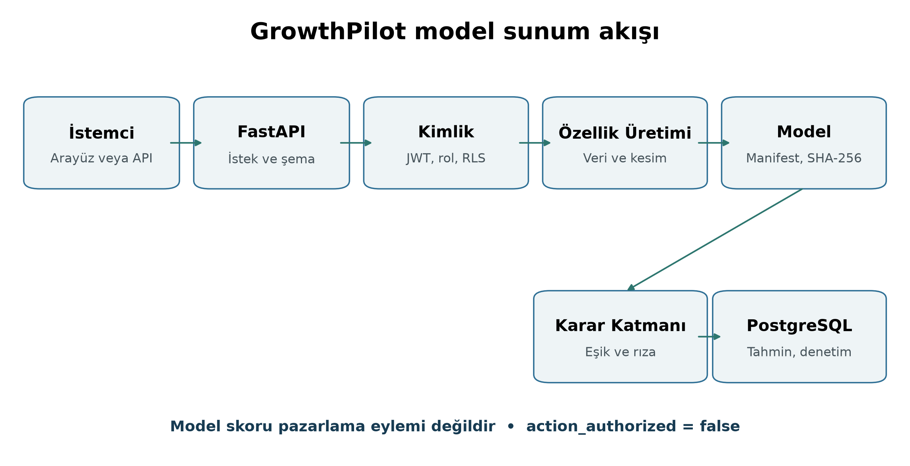
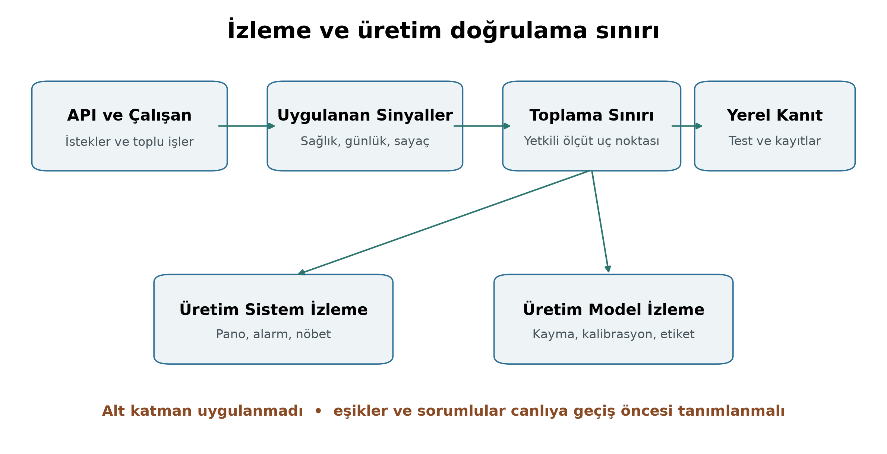

# Makine Öğrenmesi Proje Dokümantasyonu Model Dağıtımı

GrowthPilot AI Müşteri Hareketsizliği Modelinin Güvenli ve İzlenebilir Sunumu

**Hazırlayan:** Şahin Başcı
**Program:** Samsung Innovation Campus Pazarlamada Yapay Zekâ Bitirme Projesi
**Proje:** GrowthPilot AI
**Teslim tarihi:** 21 Eylül 2026
**Belge durumu:** Yerel uygulama ve test kanıtı tamamlandı; canlı ortam dağıtımı yapılmadı

**Yapay zekâ kullanım beyanı:** Bu çalışmada yapay zekâ araçlarından teknik kontrol, taslak düzenleme ve dil iyileştirme süreçlerinde destek alınmıştır. Nihai içerik, kod referansları ve teknik sonuçlar proje deposu üzerinden doğrulanmıştır.

## 1 Genel Bakış

GrowthPilot AI, müşteri ve sipariş geçmişinden gelecekteki satın alma hareketsizliği olasılığını hesaplayan modeli CRM akışına bağlar. Bu rapor modelin kaydedilmesini, çalışma anında yüklenmesini, API üzerinden tahmin üretmesini, güvenliğini ve izlenmesini inceler. Çıkarım kodu, kalıcı tahmin kayıtları, iş kuyruğu ve güvenlik kontrolleri proje deposunda bulunur; yerel testlerden geçmiştir. Konteyner tanımı ve AWS Terraform kodu da depodadır. Ancak canlı bulut dağıtımı, üretim kimlik sağlayıcısı, yönetilen alarmlar ve gerçek müşteri verisiyle model doğrulaması henüz yapılmamıştır.

Model, internete açılan ayrı bir makine öğrenmesi servisi değildir. FastAPI tabanlı modüler uygulamanın `intelligence` alanı, organizasyon kapsamındaki veriden özellikleri üretir, SHA-256 değeri doğrulanmış modeli çağırır, karar katmanını uygular ve sonucu PostgreSQL'e eklemeli kayıt olarak yazar. Böylece yetkilendirme, organizasyon bağlamı, veri modeli ve denetim kaydı aynı işlem sınırında kalır. Bunun bedeli, modelin tek başına ölçeklenememesi ve model değişikliğinin arka uç sürümüne bağlı olmasıdır.

### 1.1 Dağıtım durum matrisi

| Yetenek | Durum | Depodaki kanıt |
| --- | --- | --- |
| Dondurulmuş `joblib` model eseri | Uygulandı ve yerelde doğrulandı | `.local/models/final_candidate.joblib`; SHA-256 yeniden hesaplandı |
| Manifest ve sürüm soyu | Uygulandı ve yerelde doğrulandı | `artifacts/ml/final_candidate.json`, `final_evaluation.json`, `model_registry.json` |
| Yükleme öncesi SHA-256 denetimi | Uygulandı ve test edildi | `backend/app/intelligence/service.py`; `test_intelligence_inference.py` |
| Tek müşteri çıkarımı ve tahmin geçmişi | Uygulandı ve yerelde test edildi | `backend/app/intelligence/router.py`; `test_intelligence_inference.py` |
| Kalıcı toplu puanlama işi | Uygulandı ve yerelde test edildi | PostgreSQL outbox, Redis, Dramatiq, `ScoringJob`; `test_worker.py` |
| RBAC ve organizasyon yalıtımı | Uygulandı ve yerelde test edildi | `identity/`, zorunlu RLS geçişleri, negatif yalıtım testleri |
| Container model sağlama sözleşmesi | Uygulandı ve statik test edildi | BuildKit secret, oluşturma anında SHA-256 denetimi, sabit `GP_MODEL_PATH` |
| AWS altyapısı | Referans mimari mevcut | `infra/terraform/aws/`; `terraform validate` canlı uygulama değildir |
| HTTP gözlemlenebilirliği | Uygulandı ve yerelde test edildi | istek kimliği, güvenli günlük alanları, sayaç, span ve sağlık uç noktaları |
| Üretim OIDC | Canlı doğrulama bekliyor | Kod sınırı mevcut; gerçek issuer, JWKS ve organizasyon eşlemesi doğrulanmadı |
| Canlı AWS dağıtımı | Yapılmadı | `terraform apply`, container yayını, DNS ve bulut kaynağı değişikliği yok |
| Gerçek zamanlı model kayması ve performans izleme | Planlandı | Ölçüt listesi tanımlı; canlı veri/etiket hattı ve alarm yok |
| Otomatik pazarlama eylemi | Bilinçli olarak kapalı | Her yanıtta `action_authorized=false`; insan onayı zorunlu |

### 1.2 Dağıtıma konu model

| Alan | Dondurulmuş değer |
| --- | --- |
| Model ailesi | L2 lojistik regresyon, `C=0.01`; sigmoid olasılık kalibrasyonu |
| Hedef | `future-inactivity-v1`: izleyen 90 günde uygun satın alma olmaması |
| Özellik ve veri bölümü sürümü | `customer-behavior-v1`; `temporal-split-v1` |
| Nihai zamansal test | 2.772 satır; kesim tarihi 1 Eylül 2011 |
| PR-AUC | 0,647525 |
| ROC-AUC | 0,765878 |
| Brier skoru ve ECE-10 | 0,199854 ve 0,095054 |
| Dondurulmuş eşik | 0,812509305136 |
| Model SHA-256 | `942d705d66a9469d57494626a99da83c91a9a895a3a2b2d7e977ff3ba56952ad` |

Bu değerler `artifacts/ml/final_evaluation.json` ve model dosyası üzerinden yeniden doğrulanmıştır. Tek tarihsel perakendeciye ait test sonucu canlı ortam performansını, nedensel kampanya etkisini veya gerçek müşteri gelirini göstermez. Dağıtım kapısı bu nedenle `demo_only_until_business_domain_validation` olarak kayıtlıdır.

## 2 Model Serileştirme

### 2.1 Tek eser içinde özellik dönüşümü model ve kalibrasyon

Model serileştirme, eğitimden çıkan Python nesnesinin yeniden eğitim yapılmadan çıkarım ortamında yüklenebilmesidir. `scripts/refine_model.py`, yalnız sınıflandırıcıyı değil, bütün dönüşüm zincirini kaydeder. `BehaviorFeatureTransformer`, sağa çarpık ve negatif olmayan sayısal değişkenlere `np.log1p(...)` tabanlı logaritmik dönüşüm uygular. Ardından `SimpleImputer(strategy="median", add_indicator=True)`, `RobustScaler(quantile_range=(5, 95))` ve ülke alanı için `OneHotEncoder` çalışır. Sınıflandırıcı `LogisticRegression(C=0.01)` modelidir; `StandardScaler` kullanılmaz. Bu bütün, `FrozenEstimator` üzerinden `CalibratedClassifierCV(method="sigmoid")` ile kalibre edilir. `joblib.dump(calibrated, MODEL)` çağrısı nesneyi `.local/models/final_candidate.joblib` yoluna yazar. Dondurulmuş model dosyası 8.336 bayttır ve ek sıkıştırma kullanılmaz.

Bu paketleme, eğitim ve sunum arasında dönüşüm adımlarının ayrı kodlarla yeniden yazılmasından doğabilecek özellik sapmasını azaltır. Yine de operasyonel özellik üretimi ayrı bir sorumluluktur. `build_operational_features`, organizasyon kapsamındaki sipariş, satır ve iade kayıtlarından modele verilen 24 ham sütunu kesim zamanına göre hesaplar. Dönüşüm zinciri sütun adlarını doğrular ve `MODEL_FEATURES` sırasını korur.

Eğitimde `country` gerçek değişkenlik taşıyan bir model girdisidir. Operasyonel veride bu alan bulunmadığı için mevcut çıkarım kodu her kayıtta `country="__missing__"` üretir. Bu, eğitim-sunum özellik dağılımı uyumsuzluğu (training-serving skew) riski ve üretime hazırlık açığıdır. Canlıya geçmeden önce üç seçenekten biri kanıtlanmalıdır: operasyonel veri modeline güvenilir ülke bilgisi eklemek; `country` olmadan yeni bir aday modeli yeniden değerlendirmek; veya bütün ülke değerlerinin eksik olduğu ayrı bir duyarlılık/holdout testi çalıştırmak. Dondurulmuş nihai test sonucu üzerinden yeni ayar yapılamaz.

### 2.2 Dondurma ve yeniden üretilebilirlik sınırı

Seçim beş lojistik regresyon, altı random forest ve on iki LightGBM denemesinin doğrulama PR-AUC sonuçlarına göre yapılmıştır. Seçilen işlem hattı eğitim ve doğrulama kesimleriyle yeniden uydurulmuş, sigmoid kalibrasyon ayrı 1 Haziran 2011 kesiminde yapılmış ve yaklaşık yüzde 10 inceleme kapasitesine karşılık gelen eşik aynı kesimde belirlenmiştir. Nihai 1 Eylül 2011 testi yalnız bir kez açılmış; manifest `final_test_accessed=true` ve `post_test_retuning_permitted=false` alanlarıyla bu sınırı kaydetmiştir.

Yeniden üretilebilirlik yalnız model dosyasına dayanmaz. Manifest hedef, özellik ve veri bölümü sürümlerini; Git revizyonunu; deneme parametrelerini ve sonuçlarını; kalibrasyon ölçütlerini; eşik politikasını; MLflow çalıştırma kimliğini ve model SHA-256 değerini saklar. `artifacts/ml/model_registry.json`; kayıtlı model `growthpilot-churn-inactivity`, `champion` takma adı, sürüm 1, çalıştırma kimliği `6259c8ebe3744b5aac04c1b70cedbb26`, model SHA-256 değeri ve `demo_only_until_business_domain_validation` kapısını birlikte kaydeder. `champion`, yerel model kayıt soyudur; üretime dağıtım yapıldığı anlamına gelmez.

### 2.3 Bütünlük ve güvenli yükleme

`joblib`, pickle protokolüne dayandığı için güvenilmeyen bir dosyayı yüklemek keyfi kod çalıştırabilir. scikit-learn, pickle tabanlı modellerin yalnız güvenilir kaynaklardan yüklenmesini önerir [2]. GrowthPilot bu riski tamamen ortadan kaldırdığını iddia etmez. Uygulama, `joblib.load` öncesinde model dosyasının SHA-256 değerini manifestteki değerle karşılaştırır.

```python
class LocalCandidatePredictor:
    def __init__(self, model_path: Path, manifest_path: Path) -> None:
        self.manifest = json.loads(manifest_path.read_text())
        actual = hashlib.sha256(model_path.read_bytes()).hexdigest()
        if actual != self.manifest.get("artifact_sha256"):
            raise RuntimeError("Frozen candidate checksum mismatch")
        self._model = joblib.load(model_path)

    def predict(self, features: pd.DataFrame) -> float:
        return float(self._model.predict_proba(features)[0, 1])
```

Kod parçası `backend/app/intelligence/service.py` içindeki gerçek uygulamadır. `test_candidate_loader_rejects_checksum_mismatch`, yanlış SHA-256 değeri taşıyan dosyanın nesneye dönüştürülmeden reddedildiğini sınar. `scripts/evaluate_final.py`, `scripts/explain_model.py` ve `scripts/register_model.py` de işlemlerinden önce aynı değeri doğrular.

### 2.4 Container modelini sağlama sözleşmesi

Denetim başlangıcında `Settings.model_path` varsayılanı `.local/models/final_candidate.joblib` iken arka uç Dockerfile'ı yalnız manifesti container'a kopyalıyordu. `.dockerignore` ise `.local` dizinini dışlıyordu. Dolayısıyla Dockerfile tek başına çalışan bir çıkarım container'ı üretemiyordu.

Arka uç Dockerfile'ı, onaylı model dosyasının BuildKit `growthpilot_model` gizli girdisiyle sağlanmasını zorunlu kılar. `backend/app/platform/model_artifact.py` dosyayı yüklemeden önce SHA-256 değerini manifestle karşılaştırır; eksik veya uyumsuz dosya imaj oluşturmayı durdurur. Doğrulanan dosya `/app/models/final_candidate.joblib` konumuna salt okunur kurulur. `GP_MODEL_PATH` bu dosyayı, `GP_MODEL_MANIFEST_PATH` ise `/app/artifacts/ml/final_candidate.json` manifestini gösterir. Uygulama yükleme öncesinde hash'i yeniden denetler. Bunlar kod ve test düzeyinde doğrulanmıştır; Docker motoru bulunmadığından gerçek imaj oluşturulmamıştır. Özel model deposu, imzalı terfi ve imaj yayımlama süreci de henüz uygulanmamıştır.

## 3 Model Sunumu

### 3.1 İstek üzerine çıkarım akışı

FastAPI isteği önce bearer token doğrulamasından geçer. OIDC modunda RS256 imzası, issuer, audience, `exp`, `iat`, `sub` ve `iss` alanları ile JWKS'den seçilen anahtar doğrulanır. Ardından token'daki issuer ve subject, `resolve_actor` ile iç aktör kimliğine çevrilir. `X-Organization-ID` yalnız hedef organizasyonu seçer; aktörü belirlemez. Etkin üyelik bulunmadan organizasyon bağlamı kurulmaz. Aktör ve organizasyon kimlikleri işlem kapsamında PostgreSQL'e yazılır, sonra `Permission.SCORE` denetlenir. Bu akıştan sonra müşteri organizasyon kapsamında okunur, demo kapısı denetlenir, zamana duyarlı özellikler üretilir ve SHA-256 değeri doğrulanmış model olasılık verir.



*Şekil 1. İstek üzerine puanlama, güvenlik sınırı, model eseri ve kalıcı tahmin kaydı.*

Karar katmanı olasılığı dondurulmuş eşikle karşılaştırır ve o anda geçerli e-posta, SMS ve reklam rızalarını okur. Eşik altındaki müşteri `monitor`, eşik üstü ve izinli kanal bulunan müşteri `review_retention`, izinli kanal bulunmayan müşteri `no_contact_review` durumuna geçer. Sonuç; olasılık, eşik, karar durumu, izinli kanallar, neden kodları, doğrudan isim, e-posta veya telefon gibi kimlik bilgileri içermeyen türetilmiş özellik anlık görüntüsü ve model soyu ile `customer_predictions` tablosuna yazılır. Aynı veritabanı işlemi içinde denetim ve outbox kayıtları da oluşturulur.

Bu akış bir pazarlama mesajı göndermez. `human_approval_required` alanı inceleme ihtiyacını belirtir; `action_authorized` her koşulda `false` kalır. Skor, müşteriye temas için hukuki dayanak veya kampanya bütçesi yetkisi değildir.

### 3.2 Toplu puanlama ve kalıcı iş durumu

Toplu istek önce `ScoringJob` satırını ve `intelligence.batch_score_requested` outbox olayını aynı veritabanı işlemi içinde oluşturur; istemciye 202 döner. Güvenilen dağıtıcı, organizasyon kimliğini yapılandırmadan alır ve Redis'e yalnız organizasyon ile olay UUID'lerini koyar. Dramatiq arka plan çalışanı olayı aldığında saklanan aktörün üyeliğini ve `Permission.SCORE` yetkisini yeniden denetler. Yetki geri alınmışsa iş `failed` olur; geçerliyse aktif müşteriler tek tek puanlanır. Sonuçta toplam, başarılı, uygunluk nedeniyle atlanan ve hata alan müşteri sayıları ile `succeeded` veya `partial` durumu saklanır.

PostgreSQL iş ve outbox durumunun kalıcı kaynağıdır. Redis kaybı iş satırını silmez; dağıtıcı, sınırlı yeniden deneme ve kiralama alanlarıyla olayı yeniden gönderebilir. Dramatiq'in kendi yeniden denemesi, iki rakip döngü oluşmaması için kapalıdır. Denetimde Terraform komutunun aktör içermeyen `app.platform.jobs` modülünü hedeflediği görüldü. Komut, broker ve Dramatiq aktörünün bulunduğu `app.platform.worker` olarak düzeltildi. Statik test hem bu eşleşmeyi hem eski komutun bulunmadığını denetler.

### 3.3 Yerel çalışma, container ve AWS referansı

Yerel geliştirme bileşenleri Python 3.12/FastAPI API, PostgreSQL, Redis/Dramatiq, Next.js arayüzü, yerel model dosyası ve SQLite tabanlı MLflow kaydıdır. Arka uç container'ı iki aşamalıdır: kilitli `uv` bağımlılıklarını oluşturma aşamasında kurar, Python 3.12 slim çalışma ortamına taşır ve Uvicorn'u root yetkisi olmayan `growthpilot` kullanıcısıyla 8000 portunda çalıştırır. Docker motoru bulunmadığı için container oluşturma, tarama veya imzalama sonucu yoktur.

Terraform; iki kullanılabilirlik bölgesine yayılan ağı, açık ve özel alt ağları, NAT gateway'i, güvenlik gruplarını, HTTPS dinleyicili Application Load Balancer'ı, özel ECS/Fargate API, web ve arka plan çalışanı servislerini, şifreli RDS PostgreSQL'i, aktarımda ve depolamada şifreli ElastiCache Redis'i, SSE-KMS korumalı S3 alanını ve CloudWatch günlük grubunu tanımlar. Gizli değerler HCL kaynak koduna sabit yazılmaz. `database_password` ve `redis_auth_token` hassas Terraform girdileridir ve güvenli CI secret kaynaklarından sağlanmalıdır. Hassas değerler Terraform durum dosyasında bulunabilir. Bu nedenle canlı kullanımda uzaktan ve şifreli state, sıkı state erişim kontrolü ve secret rotation ayrıca yapılandırılmalıdır. Depoda uzaktan Terraform backend yapılandırması yoktur.

Yerel PostgreSQL, Redis ve model dosyası, geliştirme ve tekrarlanabilir testler için ücretli bulut hizmeti gerektirmez. AWS referansı ise konteyner iş yükünü, yönetilen veri servislerini, özel ağı ve şifrelemeyi kodla tanımlar. Depoda kurum içi üretim ortamı tasarımı veya bulut sağlayıcıları arasında ölçülmüş maliyet ve gecikme karşılaştırması yoktur. Bu nedenle AWS seçimi kanıtlanmış bir üstünlük iddiası değil, onaylanmış mimari kararın denetlenebilir örneğidir.

Bu liste çalışır durumdaki AWS ortamını anlatmaz. `terraform fmt -check` ve `terraform validate`, HCL sözdizimi ile sağlayıcı şemasına karşı statik doğrulamadır; hesapta kaynak oluşturmaz, ağ yolunu çalıştırmaz ve gizli değerlerin doğruluğunu kanıtlamaz. Depoda `terraform apply`, container yayını, DNS/TLS alan adı kurulumu veya ücretli servis oluşturma kanıtı yoktur. ALB tarafında HTTPS tasarlanmış olsa da RDS istemci bağlantısında TLS'i zorlayan parameter group veya doğrulanmış `sslmode` ayarı yoktur; bu, canlıya geçiş öncesi güvenlik kapısıdır.

### 3.4 Mimari kazanımlar ve bedeller

Modüler monolitte tahmin kodu, uygulamanın mevcut organizasyon kapsamını kullanır. Aynı SQLAlchemy oturumu, satır düzeyinde güvenlik kuralları (RLS), alan kuralları ve denetim kayıtları geçerlidir. Özellik üretimi ile iş tabloları aynı sürümde kalır; küçük hacimli tahminlerde ayrı bir servise ağ çağrısı yapılmaz.

Bu yapının bedeli, her API kopyasının modeli belleğe yüklemesi ve model katmanının tek başına ölçeklenememesidir. Model değişikliği de yeni arka uç imajı yayımlamayı gerektirir. Gecikme, işlem hacmi veya bağımsız sürüm ihtiyacı artarsa `Predictor` arayüzü arkasında ayrı bir servis değerlendirilebilir. Böyle bir ayrımda organizasyon kimliği, yetkilendirme ve model soyu korunmalıdır.

## 4 API Entegrasyonu

### 4.1 Uç nokta sözleşmesi

| Yöntem ve yol | Amaç | Yetki | Temel çıktı |
| --- | --- | --- | --- |
| `POST /api/v1/intelligence/customers/{customer_id}/score` | Bir müşteri için güncel özelliklerle skor üretir ve kaydeder | `intelligence:score` | 201; `PredictionRead` |
| `GET /api/v1/intelligence/customers/{customer_id}/predictions` | Müşterinin son 100 tahminini yeni tarihten eskiye döndürür | `workspace:read` | 200; `PredictionRead[]` |
| `POST /api/v1/intelligence/batch-scores` | Organizasyon için kalıcı toplu puanlama işini kuyruğa alır | `intelligence:score` | 202; `ScoringJobRead` |
| `GET /api/v1/intelligence/batch-scores/{job_id}` | İş durumu ve sayaçlarını döndürür | `workspace:read` | 200; `ScoringJobRead` |
| `GET /health/live` | Uygulama işleminin HTTP yanıtı verebildiğini gösteren yüzeysel canlılık kontrolü | Genel | `{"status":"ok"}` |
| `GET /health/ready` | Veritabanı bağlantısını ve runtime rolünün RLS’yi bypass etmediğini denetler | Genel | 200 `ready` veya 503 `unavailable` |
| `GET /api/v1/metrics` | Prometheus metin formatında uygulama ölçütlerini sunar | `audit:read` | HTTP istek sayacı |

### 4.2 İstek biçimleri

| Uç nokta grubu | Yol girdisi | Başlık girdisi | İstek gövdesi |
| --- | --- | --- | --- |
| Tek müşteri skoru ve geçmişi | `customer_id`, UUID | Bearer token ve `X-Organization-ID` | Yok |
| Toplu iş oluşturma | Yok | Bearer token ve `X-Organization-ID` | Yok |
| Toplu iş durumu | `job_id`, UUID | Bearer token ve `X-Organization-ID` | Yok |
| Canlılık ve hazır olma | Yok | Yok | Yok |
| Ölçütler | Yok | Bearer token ve `X-Organization-ID` | Yok |

Uygulama bu uç noktalarda JSON istek gövdesi kabul etmez. Aktör, bearer token'daki issuer ve subject bilgilerinden `resolve_actor` ile bulunur. `X-Organization-ID` yalnız hedef organizasyonu seçer ve etkin üyelik doğrulanmadan kapsam kurulmaz. Müşteri veya iş kimliği yol parametresinden gelir. Tek müşteri skorunda uygun siparişi olmayan veya son uygun satın alımı 180 günlük pencerenin dışında kalan müşteri için 409 döner. Varsayılan demo kapısı açıkken demo olmayan organizasyonda da 409 üretilir. Başka organizasyona ait müşteri 404 olarak görünür; böylece kaynağın varlığı organizasyon sınırı dışına açıklanmaz.

### 4.3 Tahmin ve toplu iş yanıtları

PredictionRead şeması id, customer_id, created_at, scored_at, feature_cutoff, inactivity_probability, frozen_threshold, decision_state, eligible_channels, reason_codes, provenance, human_approval_required ve action_authorized alanlarını içerir. Aşağıdaki UUID'ler, zamanlar ve 0,84 olasılığı yalnızca şemayı göstermek için üretilmiştir. Model sürümü ve SHA-256 değeri ise proje model eserinin kayıtlı soy bilgisidir; örnek gerçek müşteri veya canlı ortam ölçümü değildir.

```json
{
  "id": "00000000-0000-4000-8000-000000000101",
  "customer_id": "00000000-0000-4000-8000-000000000202",
  "created_at": "2026-09-20T09:15:01Z",
  "scored_at": "2026-09-20T09:15:00Z",
  "feature_cutoff": "2026-09-20T09:15:00Z",
  "inactivity_probability": 0.84,
  "frozen_threshold": 0.812509305136,
  "decision_state": "review_retention",
  "eligible_channels": ["email"],
  "reason_codes": ["ABOVE_FROZEN_REVIEW_THRESHOLD", "CONSENTED_CHANNEL_AVAILABLE"],
  "provenance": {
    "target_version": "future-inactivity-v1",
    "feature_version": "customer-behavior-v1",
    "split_version": "temporal-split-v1",
    "model_version": "f39712c90301499a992427cc3becb008",
    "model_sha256": "942d705d66a9469d57494626a99da83c91a9a895a3a2b2d7e977ff3ba56952ad",
    "explanation_method": "linear_shap_log_odds"
  },
  "human_approval_required": true,
  "action_authorized": false
}
```

`eligible_channels`, güncel rıza durumunu yansıtır fakat kampanya oluşturmaz. Ayrı insan onayı, durdurma anahtarı ve bütçe denetimleri geçmeden eylem yürütülemez. Toplu iş yanıtı `id`, `status`, `total_customers`, `scored_customers`, `skipped_customers`, `failed_customers`, `model_sha256`, `error_code`, `created_at` ve `completed_at` alanlarını içerir.

### 4.4 Hata ve tutarlılık davranışı

FastAPI doğrulama hataları ham girdi değerini geri yansıtmadan 422 üretir. Alan hataları anlamlı 4xx yanıtlarına çevrilir; veritabanı bütünlük ayrıntıları başka organizasyon kimliklerini sızdırmamak için genel 409 mesajına indirgenir. Her yanıt `X-Request-ID` taşır. Tahmin satırı, denetim olayı ve outbox olayı aynı işlem içinde yazılır.

## 5 Güvenlik Hususları

### 5.1 Kimlik doğrulama ve yetkilendirme

Üretim sınırı sağlayıcıdan bağımsız OIDC/OAuth2/JWT'dir. OIDC yapılandırması HTTPS issuer ve JWKS URL'si ile boş olmayan audience gerektirir. Token imzası RS256 ile doğrulanır; `exp`, `iat`, `sub`, `iss` ve `aud` zorunludur. Geliştirme modu yerel HS256 uyarlayıcısını kullanabilir, ancak `environment=production` ile birlikte çalışması ayar doğrulamasında reddedilir. Gerçek kimlik sağlayıcısı, anahtar yenileme, kullanıcı yaşam döngüsü ve organizasyon eşlemesi canlı ortamda sınanmamıştır.

Rol tabanlı yetkilendirme, `ROLE_PERMISSIONS` ile sunucu tarafında uygulanır. Owner ve admin tüm yetkilere sahiptir; marketing manager `Permission.SCORE` ve `Permission.AUDIT` kullanabilir; analyst yalnız `Permission.READ` alır ve skor uç noktasına erişemez. Arayüzdeki görünürlük bir güvenlik denetimi sayılmaz. Toplu iş çalışanı da isteğin alındığı andaki yetkiye güvenmez; iş yürütülürken üyeliği ve `Permission.SCORE` hakkını tekrar kontrol eder.

### 5.2 Organizasyon yalıtımı

Doğrulanmış token'daki issuer ve subject önce `resolve_actor` ile iç kullanıcıya çevrilir. `X-Organization-ID` ile seçilen organizasyonda etkin üyelik bulunmadan kapsam kurulmaz. `set_config(..., true)` ile aktör ve organizasyon değerleri yalnız geçerli veritabanı işlemi için yazılır; bağlantı havuzundaki bir bağlantı sonraki isteğe eski kapsamı taşımaz. Uygulama sorguları ayrıca `tenant_id` filtreleri kullanır.

Veritabanı katmanında `customer_predictions` ve `scoring_jobs` dahil organizasyon kapsamındaki tablolarda `ENABLE ROW LEVEL SECURITY` ve `FORCE ROW LEVEL SECURITY` bulunur. `USING` okumayı, `WITH CHECK` yazmayı `current_tenant_id()` değerine sınırlar. Çalışma rolü tablo sahibi, superuser veya `BYPASSRLS` olamaz; hazır olma ve başlangıç denetimleri bu koşulu kontrol eder. `(tenant_id, id)` bileşik anahtarları, başka organizasyonun müşteri kaydına tahmin bağlanmasını engeller. PostgreSQL tablo sahiplerinin RLS politikalarını varsayılan olarak aşabilmesi nedeniyle `FORCE ROW LEVEL SECURITY` ve kısıtlı çalışma rolünün birlikte kullanılması önemlidir [4].

### 5.3 Model ve karar güvenliği

Model dosyası kullanıcı yüklemesinden veya genel bir URL'den alınmaz. Konteyner oluşturulurken dosya BuildKit gizli girdisi olarak sağlanmalı ve SHA-256 değeri manifestle eşleşmelidir. Uygulama ilk yüklemede aynı kontrolü yeniden yapar; ancak ardından `joblib.load` çağırır. SHA-256 dosya bütünlüğünü gösterir, kaynağın yetkili olduğunu tek başına kanıtlamaz. Özel model deposu, imzalı terfi ve imaj yayımlama süreci henüz uygulanmamıştır.

Model, tek tarihsel dış veri kümesinden geliştirildiği için varsayılan olarak yalnız demo organizasyonlarında çalışır. Uygunluk penceresi dışında tahmin yapılmaz ve başka modele sessiz geçiş yoktur. Her sonuç hedef, özellik, veri bölümü, çalıştırma ve SHA-256 bilgisini taşır. Karar katmanı rıza dışı kanal üretmez; nedensellik veya temas yetkisi iddia etmez ve `action_authorized=false` döndürür.

### 5.4 Ağ API ve tarayıcı sınırı

CORS yalnız açıkça listelenen kaynaklara izin verir; `*` ayar doğrulamasında yasaktır. Yanıtlara X-Content-Type-Options: nosniff, Referrer-Policy: no-referrer, Cache-Control: no-store, X-Frame-Options: DENY, Permissions-Policy ve Content-Security-Policy eklenir. HSTS yalnız üretim ortamında eklenir. Terraform referansı HTTP'yi HTTPS'e yönlendirir ve ALB için TLS politikası tanımlar. API görevleri özel alt ağdadır ve 8000 portuna yalnız ALB güvenlik grubundan erişim kabul eder.

OWASP API Security Top 10; nesne düzeyi yetkilendirme, kimlik doğrulama ve güvenlik yanlış yapılandırması risklerini öne çıkarır [7]. GrowthPilot'taki sunucu tarafı yetki kontrolü, organizasyon kapsamı, RLS ve açık CORS/header politikası bu risklere karşı katmanlı savunma sağlar. Dış sızma testi yapılmadığı için sistemin "tam güvenli" olduğu iddia edilmez.

### 5.5 Gizli değerler ve şifreleme sınırı

`.env` dosyaları Git dışında tutulur; `.env.example` yalnız yer tutucu ve yerel kurulum yönlendirmesi içerir. Uygulama ayarlarında parolalar ve token'lar `SecretStr` ile taşınır. Broker hatalarının ham metni günlüğe yazılmaz; URL içinde kimlik bilgisi bulunabileceği varsayılır. Terraform bir Secrets Manager nesnesi ve KMS anahtarı tanımlar, ancak gerçek OIDC, veritabanı, Redis ve HMAC değerleri yetkili bir dış süreçle doldurulmalıdır.

AWS referansında RDS depolaması ve yedekleri KMS ile şifrelidir. ElastiCache için aktarımda ve depolamada şifreleme açıktır. S3 genel erişime kapalı ve SSE-KMS korumalıdır; CloudWatch günlük grubu da KMS kullanır. Genel istemci trafiği ALB'de TLS ile sonlandırılır. Buna karşılık bu kontroller yalnız kod olarak mevcuttur; anahtar politikaları, TLS sertifikası, RDS istemci TLS zorlaması, gizli değer yenileme ve geri yükleme yetkileri canlı hesapta doğrulanmamıştır. Belge KVKK veya GDPR uyumluluk sertifikası iddia etmez.

## 6 İzleme ve Günlükleme

### 6.1 Uygulanan sistem gözlemlenebilirliği

HTTP ara katmanı her istek için UUID tabanlı `request_id` üretir, bunu `X-Request-ID` yanıt başlığına ekler ve `method`, HTTP `status` ile `duration_ms` alanlarını `growthpilot.http` günlüğüne yazar. Aynı sınırda `http.request` adlı OpenTelemetry uyumlu span açılır. Depoda iz dışa aktarıcısı veya toplayıcısı yoktur; bu nedenle span oluşması, dağıtılmış izlerin canlı bir izleme sistemine aktarıldığı anlamına gelmez.

Prometheus istemcisi `growthpilot_http_requests_total{method,status}` sayacını üretir. `/api/v1/metrics` yalnız `Permission.AUDIT` hakkı olan kullanıcıya açıktır. Kodda istek gecikmesi histogramı, tam RED ölçüt seti veya özel puanlama sayacı yoktur. İstek süresi yapılandırılmış günlükte yer alır; toplu işin başarı, atlama ve hata adetleri `ScoringJob` satırında kalıcı sayaçlardır.

`/health/live` yalnız işlemin HTTP yanıtı verebildiğini gösterir. `/health/ready`, veritabanında `SELECT 1` çalıştırır ve çalışma rolünün superuser, `BYPASSRLS` ya da tablo sahibi olmadığını doğrular. Redis'i, model SHA-256 değerini, nesne deposunu veya arka plan kuyruğunu kontrol etmez.

Denetim izi; tahmin oluşturma, toplu iş talebi ve işin tamamlanması gibi olayları aktör, organizasyon, varlık ve sınırlı ayrıntılarla kaydeder. Denetim uç noktası `Permission.AUDIT` ve RLS ile korunur. Outbox olayları operasyonel güvenilirlik içindir; merkezi günlük sisteminin yerini tutmaz.



*Şekil 2. Uygulanan sinyaller ile henüz kurulmamış üretim izleme ve alarm katmanı.*

### 6.2 Sistem izleme hedefleri

Üretim ortamında istek hacmi, 4xx ve 5xx oranları, p50/p95/p99 gecikme, hazır olma denetimi başarısızlığı, API ve arka plan çalışanı yeniden başlatmaları, Redis teslim gecikmesi, outbox birikimi, başarısız/kısmi toplu işler ve veritabanı bağlantı sağlığı izlenmelidir. Prometheus, çevrim içi servislerde istek sayısı, hata ve süre sinyallerinin izlenmesini önerir [5]. Mevcut uygulama yalnız HTTP sayacı ile durum ve süre günlüklerini sağlar. Gecikme histogramları, Grafana panoları, hizmet seviyesi hedefleri ve nöbetçi uyarı politikası kurulmamıştır.

Terraform, CloudWatch günlük grubunu ve ECS Container Insights ayarını tanımlar. CloudWatch alarmı, pano, abonelik filtresi, ölçüt arka ucu, OpenTelemetry toplayıcısı veya nöbetçi entegrasyonu tanımlamaz. Bu nedenle CloudWatch'un canlı sistemi izlediği söylenemez. Günlük saklama değeri kodda 30 gündür; gerçek hukuki ve operasyonel saklama kararı verilmemiştir.

### 6.3 Makine öğrenmesi izleme hedefleri

Sistem sağlığı model sağlığıyla aynı değildir. Güncel organizasyon verisinde aşağıdaki göstergeler model ve karar politikasının ayrı katmanlarında izlenmelidir:

- Girdi dağılımı ve veri kalitesi: zorunlu sütunlar, eksik değer oranları, aralık ihlalleri, yeni kategoriler ve özellik üretim hataları. Özellikle `country="__missing__"` oranı canlıya geçiş öncesi ayrı bir kapıdır.
- Veri ve tahmin kayması: eğitim referansına göre özellik ve skor dağılımları, dondurulmuş eşik üstü pay ve hareketsizlik tahmini yaygınlığı.
- Gecikmeli etiket performansı: PR-AUC, ROC-AUC, Brier, ECE ve kalibrasyon; yüzde 5, 10 ve 20 kapasitede kesinlik, duyarlılık ve artış.
- Uygun ve hukuka uygun olduğunda alt grup sonuçları: örneklem büyüklüğüyle birlikte hata ve kalibrasyon farkları; bu alanlar yeni hassas veri toplamayı otomatik olarak meşrulaştırmaz.
- Model soyu: hedef, özellik, veri bölümü, çalıştırma, eşik ve SHA-256 değişimleri; onaysız veya beklenmeyen sürüm değişimi alarm sebebidir.

Bu ölçütlerin canlı hesapları henüz yoktur. Gerçek etiketler, organizasyon bazlı başlangıç değerleri, en az örneklem, pencere uzunluğu, uyarı eşikleri ve sorumlu ekip belirlenmemiştir. Gerçek zamanlı PR-AUC veya kalibrasyon izleme uygulanmış değildir. NIST AI Risk Management Framework'ün ölçme ve yönetme işlevleriyle uyumlu olarak, alan uygunluğu ve zarar riski düzenli insan incelemesine bağlanmalıdır [8]. Model kayması tek başına yeniden eğitim kararı verdirmez; veri hattı, mevsimsellik, hedef yaygınlığı ve gecikmeli performans birlikte incelenmelidir.

### 6.4 Canlıya geçiş öncesi kapılar

1. Özel model deposu, imzalı model terfisi, değişmez container özet değeri ve SBOM/tarama/imzalama süreci seçilmelidir. Arka uç container'ı gerçek Docker motoruyla oluşturulmalıdır.
2. Üretim OIDC issuer, JWKS anahtar yenileme, audience, organizasyon üyeliği eşlemesi ve servis kimlikleri test edilmelidir.
3. Terraform planı bütçe, bölge/veri yerleşimi, WAF, RDS TLS zorlaması, gizli değer yenileme, uzaktan şifreli state ve IAM incelemesinden sonra onaylanmalıdır. Ancak bundan sonra kontrollü `terraform apply` yapılabilir.
4. Günlük, ölçüt ve iz arka uçları; hizmet seviyesi hedefleri, uyarı eşikleri, sorumlular ve müdahale kılavuzları kurulmalıdır. Hata enjeksiyonu ve kuyruk geri kazanım testi yapılmalıdır.
5. Şifreli yedekten yalıtılmış ortama geri yükleme tatbikatı yapılmalı; RPO ve RTO ölçülmelidir.
6. Güncel ve temsil gücü olan organizasyon verisinde özellik uyumu, model kayması, kalibrasyon, gecikmeli performans ve izin verilen alt grup riskleri doğrulanmalıdır. `country` için güvenilir operasyonel alan, ülkesiz aday model veya tüm değerleri eksik duyarlılık testi kapısından biri tamamlanmalıdır.
7. Dış sızma testi, Meta/Google/LLM deneme ortamı testleri ve hukuki/gizlilik incelemesi tamamlanmalıdır.
8. Kampanya etkisi iddia edilecekse önceden onaylanmış randomize holdout tasarımı kullanılmalıdır; model skoru tek başına nedensel etki kanıtı değildir.

## Sonuç

GrowthPilot'ın dağıtım sınırı, dondurulmuş ve SHA-256 ile doğrulanan model eserini organizasyon güvenliği içindeki FastAPI akışına bağlar. Tek müşteri ve kalıcı toplu puanlama aynı özellik, karar, model soyu ve denetim sözleşmesini kullanır. İncelemede container'ın model dosyasını sağlamaması ve Terraform arka plan çalışanının yanlış modülü başlatması iki gerçek kusur olarak bulundu. Her ikisi de kod ve test düzeyinde düzeltildi.

Mevcut durum canlı bir üretim sistemi değildir. AWS kodu uygulanmamış referans mimaridir. Üretim OIDC, yönetilen izleme ve alarm, geri yükleme tatbikatı, dış sızma testi ve gerçek müşteri model performansı doğrulanmamıştır. Ayrıca `country` alanındaki eğitim-sunum uyumsuzluğu giderilmeden model canlıya alınmamalıdır. Model yalnızca demo alanında karar desteği sağlar ve hiçbir skoru otomatik pazarlama yetkisine dönüştürmez.

## Kaynakça

1. GrowthPilot AI proje deposu. `backend/app/intelligence/service.py`, `router.py`, `schemas.py`, `decision.py`; `backend/app/main.py`; `backend/app/identity/`; `backend/app/platform/`; `backend/migrations/sql/0007_intelligence.sql`, `0009_scoring_jobs.sql`; `infra/containers/backend.Dockerfile`; `infra/terraform/aws/`; `artifacts/ml/`; `scripts/refine_model.py`, `evaluate_final.py`, `register_model.py`. `main` dalı, erişim 21 Eylül 2026.
2. scikit-learn geliştiricileri. “Model persistence.” scikit-learn User Guide. https://scikit-learn.org/stable/model_persistence.html Erişim 20 Eylül 2026.
3. FastAPI. “Deployments Concepts” ve “FastAPI in Containers Docker.” https://fastapi.tiangolo.com/deployment/concepts/ ve https://fastapi.tiangolo.com/deployment/docker/ Erişim 20 Eylül 2026.
4. PostgreSQL Global Development Group. “Row Security Policies.” https://www.postgresql.org/docs/current/ddl-rowsecurity.html Erişim 20 Eylül 2026.
5. Prometheus Authors. “Instrumentation.” https://prometheus.io/docs/practices/instrumentation/ Erişim 20 Eylül 2026.
6. OpenTelemetry Authors. “Traces.” https://opentelemetry.io/docs/concepts/signals/traces/ Erişim 20 Eylül 2026.
7. OWASP Foundation. “OWASP Top 10 API Security Risks 2023.” https://owasp.org/API-Security/editions/2023/en/0x11-t10/ Erişim 20 Eylül 2026.
8. National Institute of Standards and Technology. “AI Risk Management Framework.” https://www.nist.gov/itl/ai-risk-management-framework Erişim 20 Eylül 2026.
9. Amazon Web Services. “Architect for AWS Fargate for Amazon ECS” ve “Encrypting Amazon RDS resources.” https://docs.aws.amazon.com/AmazonECS/latest/developerguide/AWS_Fargate.html ve https://docs.aws.amazon.com/AmazonRDS/latest/UserGuide/Overview.Encryption.html Erişim 20 Eylül 2026.
10. Amazon Web Services. “At-Rest Encryption in ElastiCache” ve “Using server-side encryption with AWS KMS keys.” https://docs.aws.amazon.com/AmazonElastiCache/latest/dg/at-rest-encryption.html ve https://docs.aws.amazon.com/AmazonS3/latest/userguide/UsingKMSEncryption.html Erişim 20 Eylül 2026.

## Ek A Teknik doğrulama özeti

Model dosyasının SHA-256 değeri doğrudan yeniden hesaplanmış ve manifestle eşleştirilmiştir. Kod, veritabanı geçişleri, API şemaları, Terraform kaynakları, Dockerfile ve testler incelenmiştir. Son kalite kapısında Ruff, biçim kontrolü, strict mypy ve backend testleri; ayrıca Terraform biçim ve yapılandırma doğrulaması yeniden çalıştırılmıştır. Bu sonuçlar yerel ve statik doğrulama kanıtıdır; canlı ortam dağıtımı kanıtı değildir.
